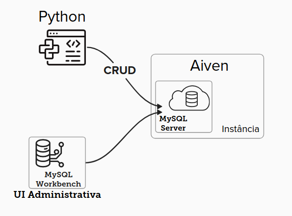

# MySQL - Overview

Responsável: Licia Sales

# MySQL

A ideia deste material é explicar como o Python, o MySQL na nuvem (usando Aiven), e o MySQL Workbench trabalham juntos para gerenciar os dados das nossas aplicações.

### **O Python**

O código que vocês estão escrevendo em Python é responsável por gerenciar a aplicação e se comunicar com o banco de dados. Quando escrevemos um código para criar, ler, atualizar ou deletar dados **(o famoso CRUD)**, o Python envia essas instruções para o banco de dados MySQL que está na nuvem, hospedado no Aiven.

### **Aiven**

O Aiven é o serviço que está hospedando o MySQL na nuvem. Ele é o “coração” do nosso sistema de dados, onde tudo o que vocês manipulam através do código é realmente armazenado. Quando o Python faz **uma requisição**, como “adicionar um novo item”, “buscar dados” ou “atualizar um registro”, **essa requisição** vai para o MySQL que está na nuvem. O Aiven garante que o banco de dados está sempre disponível, seguro e funcionando corretamente. Isso facilita o acesso aos dados de qualquer lugar, já que está na nuvem.

### **MySQL Workbench**

O MySQL Workbench é a ferramenta gráfica para visualizar e gerenciar o banco de dados. Pense nele como uma janela que nos permite ver o que está acontecendo dentro do MySQL que está na nuvem. Ele se conecta ao MySQL no Aiven e permite que vocês visualizem as tabelas, rodem queries, façam backups e até criem novas tabelas manualmente. Isso é muito útil para ver se o que vocês programaram em Python realmente funcionou. Muitas vezes, o código não dá o feedback visual que a gente precisa. O Workbench permite ver os dados em tempo real e verificar se o que o Python fez está correto. Ele é uma ferramenta de apoio essencial para garantir que o banco de dados está configurado e operando corretamente.

### **Como Tudo Funciona Junto**

**O Python** é o nosso ponto de partida. Escrevemos o código que manda as instruções para o banco de dados.

**O Aiven (MySQL Server)** na nuvem é quem recebe essas instruções e faz o trabalho de armazenar, atualizar e gerenciar os dados.

**O MySQL Workbench** é a nossa interface gráfica, onde conseguimos visualizar tudo isso acontecendo, verificar se os dados foram corretamente inseridos ou atualizados e gerenciar o banco de dados de uma maneira mais amigável.

### **Porque aprender isso?**

- **Entender a Comunicação Completa:** Vocês precisam entender como o Python conversa com o banco de dados na nuvem e como o Workbench nos ajuda a visualizar e gerenciar esses dados.
- **Identificar e Corrigir Erros:** Muitas vezes, os erros de código se refletem no banco de dados. Com o Workbench, conseguimos visualizar o que deu certo ou errado e ajustar nosso código Python.
- **Preparação para o Mundo Real:** Este fluxo é muito comum em ambientes profissionais. Saber como cada peça funciona é essencial para quem quer trabalhar com desenvolvimento de software, APIs e bancos de dados.

### **Sobre Registros, Tabelas e Relacionamentos…**

Para entender como o Python interage com o banco de dados e como o MySQL Workbench nos auxilia, é importante compreender como os registros, tabelas e relacionamentos funcionam dentro do banco de dados MySQL. 

### **Registros no Banco de Dados**

Registros são as linhas de dados que estão armazenadas em uma tabela dentro do banco de dados. Cada registro representa uma entrada única, com valores específicos para cada coluna da tabela. 

**Exemplo:** Em uma tabela de "Usuários", cada linha (registro) poderia representar um usuário específico, contendo colunas como ID, Nome, E-mail, e Idade.

### Tabela de Usuários

| ID | Nome | Email | Idade |
| --- | --- | --- | --- |
| 1 | Alice | [alice@example.com](mailto:alice@example.com) | 30 |
| 2 | Bob | [bob@example.com](mailto:bob@example.com) | 25 |

Os registros são manipulados usando comandos SQL (ex: `INSERT`, `SELECT`, `UPDATE`, `DELETE`) que o Python envia para o banco de dados. Esses comandos permitem adicionar novos registros, buscar informações, atualizar dados existentes e remover registros.

### **Tabelas no Banco de Dados**

Tabelas são a estrutura básica de armazenamento no banco de dados. Cada tabela armazena um conjunto de registros que compartilham a mesma estrutura (colunas).

### **Relacionamentos Entre Tabelas**

Relacionamentos definem como as tabelas se conectam entre si. Isso é importante para criar um banco de dados relacional onde as informações devem ser ligadas e acessadas de forma eficiente.

### **Tipos de Relacionamentos:**

**Relacionamento 1:1 (Um para Um):** Cada registro em uma tabela está associado a um e apenas um registro em outra tabela.

**Exemplo:** Imagine duas tabelas, **Usuários** e **Perfis**, conectadas por uma linha direta entre dois registros. Cada **Usuário** tem um **Perfil** associado, e vice-versa

### Tabela de Usuários

| ID | Nome | Email |
| --- | --- | --- |
| 1 | Alice | [alice@example.com](mailto:alice@example.com) |

### Tabela de Perfis

| ID | Foto | Bio |
| --- | --- | --- |
| 1 | foto1.jpg | "Developer" |

> Relacionamento: Cada usuário tem um perfil exclusivo.
> 

**Relacionamento 1:N (Um para Muitos)**

Um registro em uma tabela está associado a muitos registros em outra tabela, mas os registros na segunda tabela estão associados a apenas um registro na primeira.

**Exemplo:** Um "Usuário" pode ter muitos "Pedidos". Aqui, a tabela de “Usuários” tem um relacionamento 1:N com a tabela de “Pedidos”. O relacionamento é geralmente implementado adicionando uma chave estrangeira na tabela dos “Pedidos” que aponta para o “ID do Usuário”.

### Tabela de Usuários

| ID | Nome | Email |
| --- | --- | --- |
| 1 | Alice | [alice@example.com](mailto:alice@example.com) |

### Tabela de Pedidos

| ID | Produto | Data | Usuario_ID |
| --- | --- | --- | --- |
| 1 | Laptop | 2023-01-15 | 1 |
| 2 | Mouse | 2023-01-20 | 1 |

> Relacionamento: O usuário "Alice" (ID 1) fez dois pedidos (Laptop e Mouse).
> 

**Relacionamento N:M (Muitos para Muitos)**

Muitos registros em uma tabela estão associados a muitos registros em outra tabela.

**Exemplo:** Uma tabela “Alunos” e uma tabela “Cursos” podem ter um relacionamento N:M, onde um aluno pode estar inscrito em vários cursos e cada curso pode ter muitos alunos inscritos. Esse tipo de relacionamento geralmente requer uma **tabela intermediária** (ex: “Inscrições”) para armazenar as chaves estrangeiras de ambas as tabelas.

### Tabela de Alunos

| ID | Nome | Email |
| --- | --- | --- |
| 1 | Alice | [alice@example.com](mailto:alice@example.com) |
| 2 | Bob | [bob@example.com](mailto:bob@example.com) |

### Tabela de Cursos

| ID | Nome Curso |
| --- | --- |
| 101 | Python |
| 102 | SQL |
| 103 | Design |

### Tabela Intermediária (Inscrições)

| Aluno_ID | Curso_ID | Nota |
| --- | --- | --- |
| 1 | 101 | A |
| 1 | 102 | B+ |
| 2 | 103 | A- |

> Relacionamento: A tabela de Inscrições conecta alunos a cursos, criando um relacionamento N:M.
> 

### **E o MySQL Workbench?**

No MySQL Workbench, vocês podem visualizar todas as tabelas do banco de dados e ver como elas estão conectadas. Ele oferece ferramentas visuais para criar e ajustar esses relacionamentos de maneira gráfica. Através do Workbench, é possível criar chaves primárias e estrangeiras que estabelecem essas conexões entre tabelas, garantindo a integridade dos dados e a correta estruturação das informações.

### **Por que isso é importante?**

- **Organização de Dados:** Relacionamentos permitem que os dados sejam organizados de forma lógica e estruturada, o que facilita a recuperação de informações complexas.
- **Eficiência e Consistência:** Usar relacionamentos evita a duplicação de dados e mantém o banco de dados consistente, o que é crucial para operações complexas e integridade dos dados.
- **Facilita a Programação:** Com um banco de dados bem estruturado, o código Python se torna mais simples e eficiente, pois vocês podem buscar e manipular os dados com menos esforço e de maneira mais intuitiva.