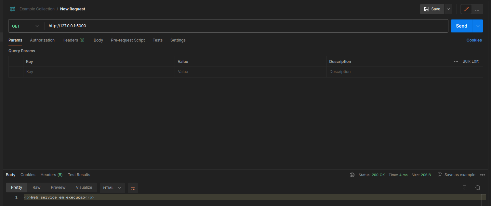
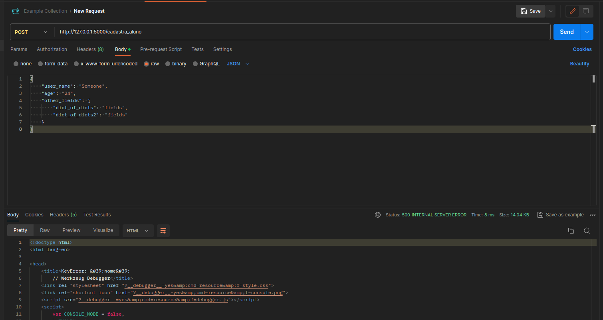
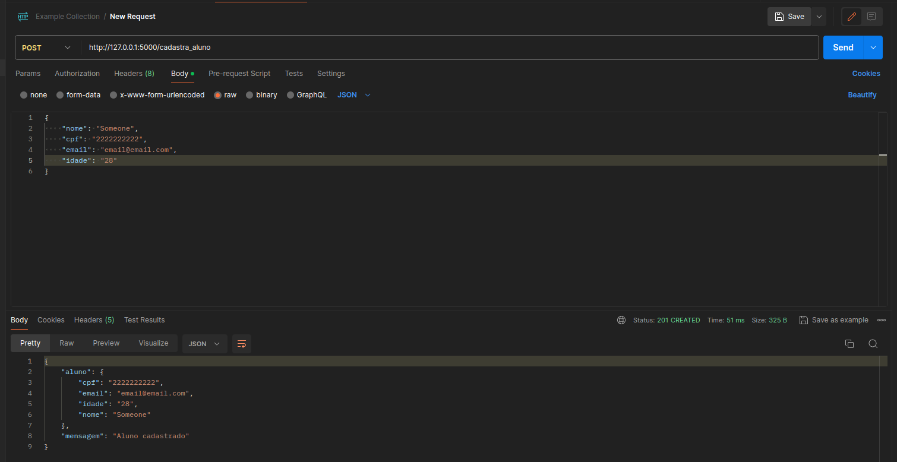

# Ferramentas Básicas: Postman - Como Usar

Responsável: Sarti

Este tópico é complementar à instalação do Postman. Caso ainda não tenha o programa baixado, inicie pelo outro guia. Continuaremos de onde paramos, com o request criado.

# Requests - Geral

Requests são requisições totalmente personalizáveis. Utilizamos elas para simular o que vai ser enviado pelo nosso site ao nosso sistema. Sendo assim, todos os nossos testes de requisições, assim como o estudo de códigos de erro, vão girar em torno das requisições realizadas pelo request. Existem vários tipos de requisições, sendo as 4 principais: Get, Put, Post e Delete. Elas serão abordadas de melhor maneira pelo professor durante as aulas. Aqui, abordarei apenas o mínimo para entender como criar testes utilizando o Postman.

## Testes

Apesar de usarmos o Postman para testes, diferentemente do pytest onde nos é dito se estamos certos ou errados, o Postman apenas testa e nos exibe um resultado. Se ele está correto ou não, nós como desenvolvedores teremos que decicir, se o programa se comporta como queremos. 

## Status Codes

Os códigos de status, ou Status Codes, são alguns códigos comuns e padronizados na internet, o que nos permite ter um meio universal de debugar e compreender uma Request, bem ou mal-sucedida. Existem vários erros de Status que devem ser consultados na internet, mas como regra a cada 100 status code, seu significado muda. E cada sub código, indica com detalhes a operação. 

100-199: Resposta informacional.

200-299: Request bem sucedido.

300-399: Redirect. Requisição bem sucedida, mas precisou/retornou um redirect.

400-499: Erro no client side, desde erro de conexão até input invalido de informações.

500+: Erro no server side, um problema diretamente com a empresa e o servidor.

Obs: Não existem TANTOS códigos assim, não existem 100 códigos de sucesso diferentes por exemplo. Apenas temos o espaço reservado para manter o padrão.

## Requests: Get

Por padrão todo request criado vem como Get, podemos ver isso no texto à esquerda da barra de busca. Essa barra de busca é onde iremos escrever os links que estamos testando as requisições, podemos testar tanto links da surface web como o nosso servidor em flask.

Após clicar em Send com a URL necessária, podemos ver a resposta do servidor. Por enquanto ela é bem simples, mas posteriormente pode vir cheia de informações. De importante na resposta de uma requisição Get temos duas informações, a resposta em si, exibida na área similar com o terminal do VScode na parte de baixo da tela, neste caso um texto “Web service em execução”, assim como o Status Code da requisição. Podemos ver o Status Code na parte superior direita desta mesma área, onde podemos ver “Status: 200 Ok”. 

## Requests: Post

Post é a requisição responsável por enviar um JSON para o servidor, ou seja, receber algo do cliente. Para enviarmos um Post válido, primeiro criamos um teste e, em seguida, precisamos mudar o tipo de requisição de Get para Post no botão à esquerda. Após isso, temos que escrever o que será enviado. Para isso, clique em “Body” abaixo da barra da URL e selecione a opção “Raw”. Uma vez feito isso, temos nossa área de escrita disponível. Certifique-se de selecionar JSON entre as opções do seletor azul à direita.

Obs: Podemos enviar em outros formatos, mas como irão perceber ao longo do semestre, JSON é um padrão para requisições web, por ser super simples, intuitivo e organizado. Para quem nunca usou antes, é basicamente um dicionário do Python, e existem diversos sites documentando JSON e ajudando a criar os seus próprios.

Observer que dessa vez o request retornou um erro, 500 Internal Server Error, isso quer dizer que eu enviei informações validas, mas que o servidor não conseguia lidar com elas (pois o código não estava preparado). Note que agora os campos estarão adequados, o que exibira um texto valido na parte de baixo e minha resposta será “201 Created”, indicando que criei um usuário com sucesso. 

## Request: Put & Delete

Ambos os métodos operam de maneira idêntica ao Post e Get, respectivamente. No entanto, estes são dedicados a editar e apagar informações do servidor. Para nós, usuários de uma API, não muda nada entre usá-los ou os métodos Post e Get, mas para o servidor e o código, essa é uma distinção muito importante, pois é ela que diferencia editar e criar um usuário, por exemplo.

# Exportando testes:

Após todos os testes estarem feitos e **SALVOS**, clique nos “…” da sua collection e ao invés de criar um request, selecione “Export”, e selecione “Collection V2.1”. Então ele irá salvar um arquivo com os testes realizados na sua máquina, este arquivo deve ser compartilhado quando quiser mostrar seus testes para os outros (inclusive em provas). 

## Conclusão

No fim, mesmo que tenhamos feitos poucos testes, não usamos nenhum front-end para testá-los. Sem precisar fazer um formulário para enviar informações, apenas interações diretas com o Back. Isso em um uso de larga escala, como no desenvolvimento de um projeto inteiro, nos permite salvar muito tempo testando diretamente o que queremos.