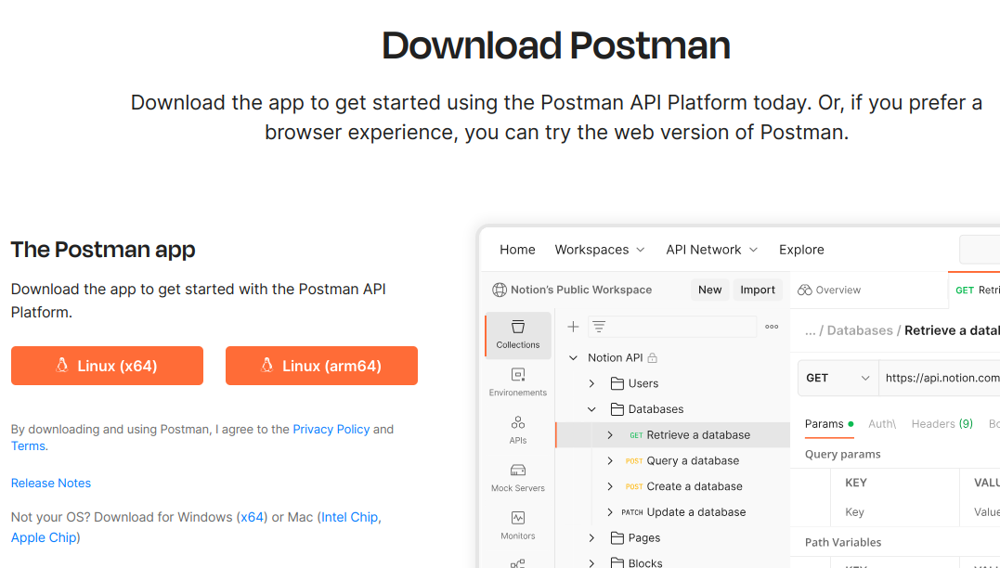
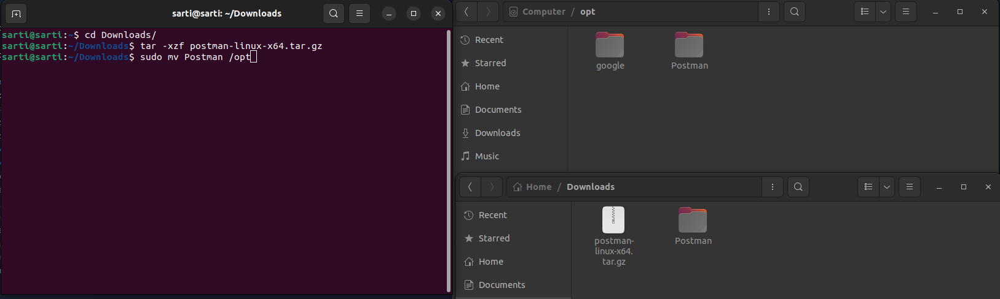
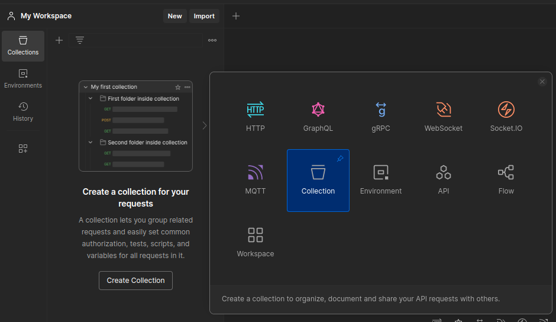

# Ferramentas Básicas: Postman - Instalação

Responsável: Sarti

# Por que Postman?

A partir do segundo semestre, uma das ferramentas que vai nos acompanhar pelo resto do curso são as Aplicações de Teste de API, dentre as várias existentes no segundo semestre utilizamos a Postman especificamente. 

O principal motivo de precisarmos de aplicações como essa é o teste isolado do Backend de um sistema API. Como devem lembrar ao longo do seu projeto de sprint session em Django no semestre passado, sempre que testávamos uma nova rota, uma nova função ou qualquer coisa nova, precisávamos abrir o navegador, entrar no link e ver as mudanças no HTML/Frontend da aplicação. E se eu falasse que esse é um método muito pouco eficiente de testar um sistema? Apesar de funcional, ele requer que percamos muito tempo trabalhando em um frontend que serve apenas para nos mostrar se o backend funciona ou não, e nem mostra todas as informações (além de que dev backend odeia front né…)

Para resolver esse problema, utilizamos o Postman, que nos permite realizar requisições para qualquer link e nos exibe o seu retorno completo. Assim, podemos pular a etapa de ficar testando no HTML do site, além de conseguirmos mais informações. Principalmente, pois como iremos ver depois do curso, Back e Frontend são coisas distintas e independentes, e o Postman é essencial para esta separação do Back.

# Instalação e Setup:

Para instalar o Postman, baixe os arquivos necessários do site ([https://www.postman.com/](https://www.postman.com/)) e siga os passos. 

Windows, Mac e Linux:

Baixe o executável x64, ele deve por padrão ir para sua pasta de Download. Execute e o programa deve ser instalado automaticamente. 

Linux (Se não der certo o passo acima):

Para estes passos presumo que seja uma plataforma x64 baseada em Debian, caso contrário busque os passos para sua máquina. Baixe o arquivo, ele por padrão estará em sua aba de Downloads e deve vir no formato de compressão “.tar.gz.” 

Após isso abra seu terminal e realoque para a aba onde estiver o “arquivo .tar.gz”, no exemplo Downloads. Após isso execute no terminal os seguintes comandos: 

1) “tar -xzf postman.tar.gz” Obs: O seu arquivo provavelmente se chamara postman… onde os pontos são outras palavras referentes ao OS ou versão. Basta escrever postman e apertar Tab para o Auto Complete.

2) “sudo mv Postman /opt”

3)”sudo ln -s /opt/Postman/Postman /usr/local/bin/postman”

Com estes comandos estamos, respectivamente, descompactando o programa na sua aba de Download (ele ja estaria funcional), movendo-o para alguma outra pasta de nossa escolha (por padrão deixei a pasta /opt, por estar próximo ao root e ser onde eu costumo guardar symbolic links, mas pode ser a pasta que quiser) e por fim criamos um link simbólico do postman. Caso queira aprender como links simbólicos funcionam, vale a pesquisa mais tarde, mas basicamente atribuímos uma palavra para a execução do programa via terminal (assim como “code” inicia o vscode). Agora basta escreve “postman” no terminal para abrir ele. 

### Setup:

Após baixar o postman, será necessário criar uma conta e logar para ter acesso à algumas features, dentre elas as collections que vamos utilizar em provas e testes. Crie sua conta e faça login, este é o único setup necessário. 

# Como utilizar o Postman - Primeiros Passos:

Ao longo da disciplina o uso do postman vai ficar mais intuitivo, tal como a necessidade dele mais clara, mas por enquanto podemos focar no passo a passo básico. Já estando logado, sua tela inicial deve estar vazia (sem testes) e pronta para uso. Iniciamos criando uma collection, que é basicamente uma pasta que irá guardar nossos testes. Basta clicar em “New” no botão do lado superior esquerdo da tela que um menu aparecera, selecione “Collection”. 

Após criar nossa collection, passe o mouse por cima dela na aba esquerda da tela e clique nos “…”. Selecione “Add request”. Assim criaremos um request, nossa unidade de testes.

Para um guia de como utilizar o postman, siga para “Ferramentas Básicas: Postman - Como Usar”