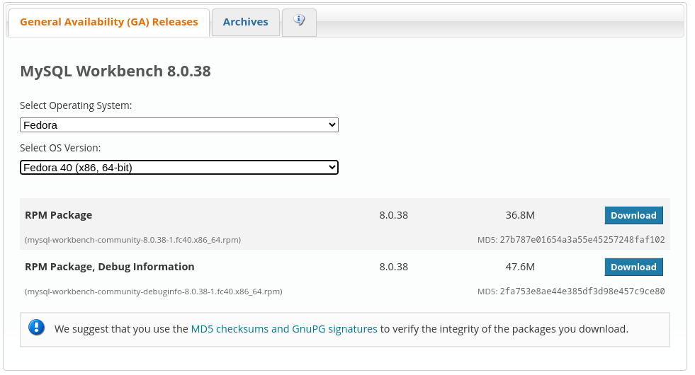
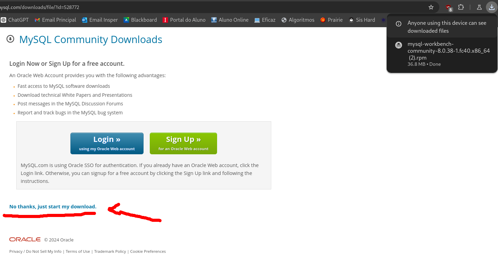
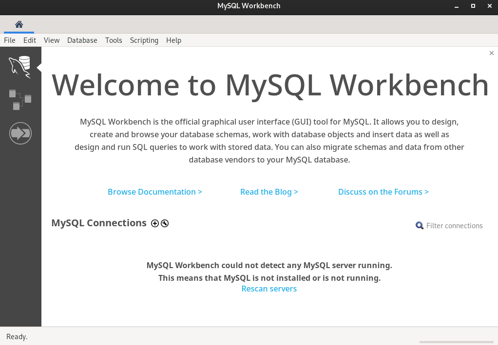
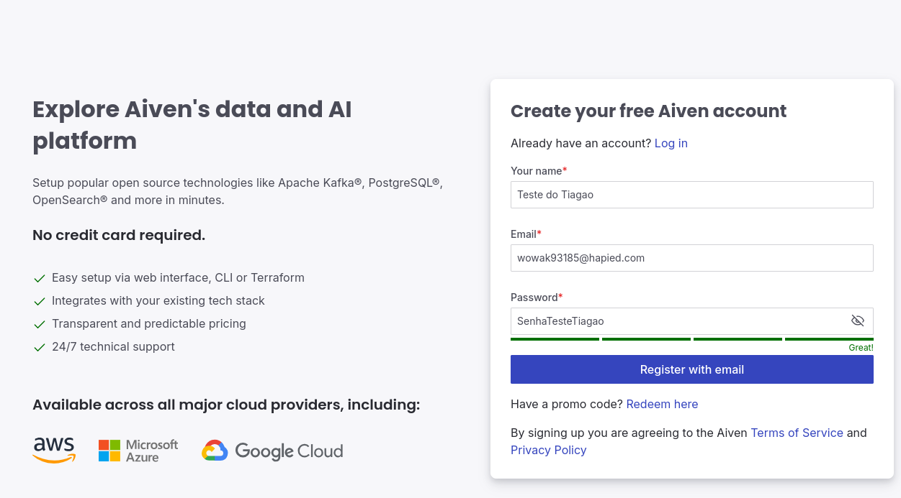
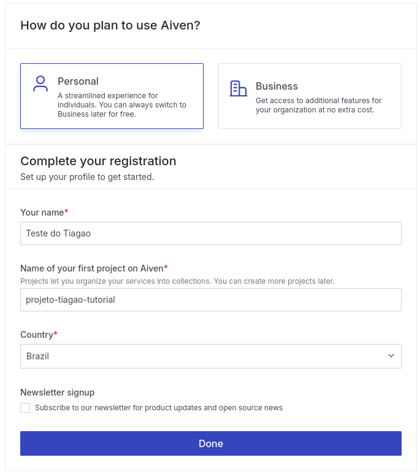
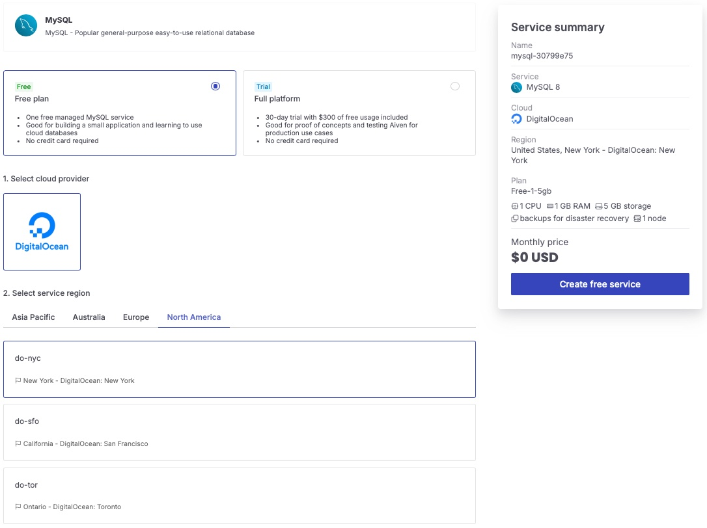
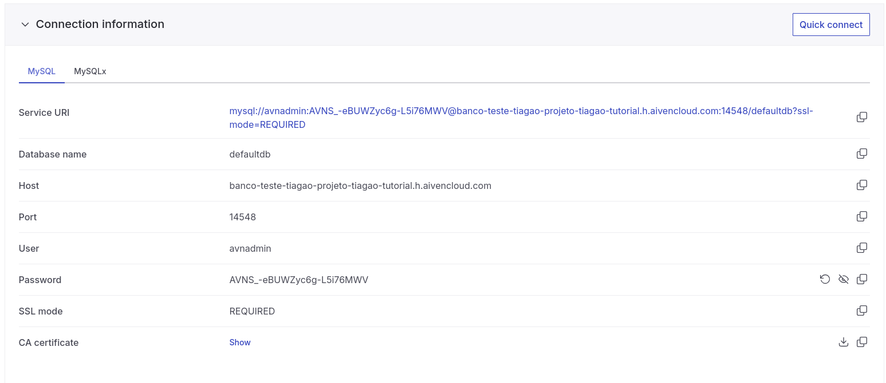
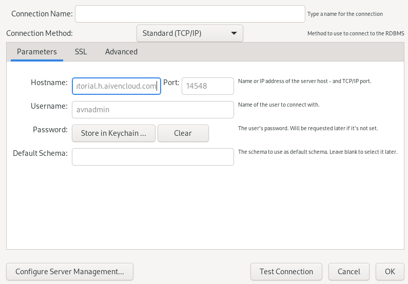
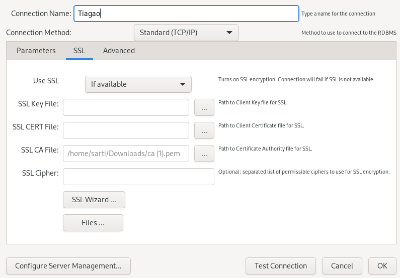
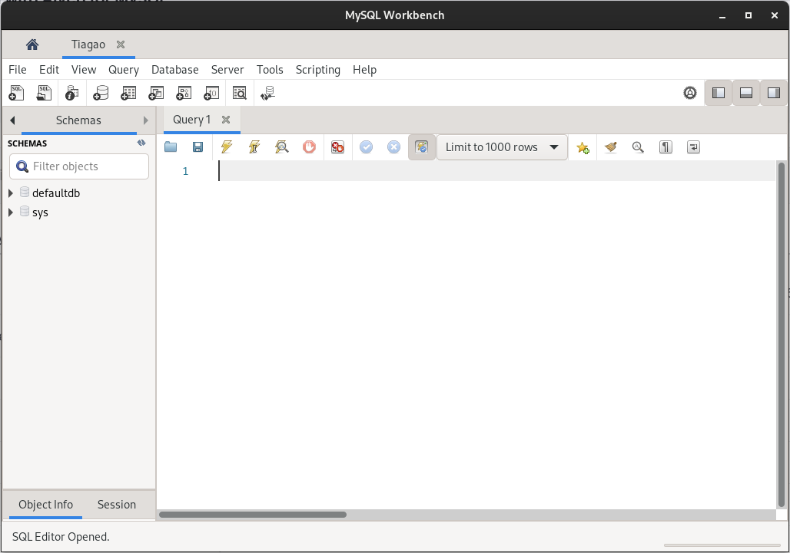

# MySQL Workbench: Instalação

Responsável: Sarti

### AVISO:

Este guia serve para ajudar vocês a baixar e configurar o ambiente utilizado ao longo do semestre para MySQL. Para questões teóricas relacionadas a Bancos de Dados Relacionais, consulte o outro material.

Neste semestre do curso, utilizaremos o MySQL como banco de dados relacional para nossos estudos. Este guia serve para ajudá-los a baixar o MySQL Workbench e o Aiven, que será nosso banco de dados em nuvem.

Podemos iniciar tanto pelo Aiven quanto pelo MySQL Workbench; escolha por onde desejar começar.

O tutorial está sendo feito em um Fedora Linux, podendo ser levemente diferente de acordo com o seu sistema operacional. Atenha-se a pequenos detalhes.

# MySQL Workbench

MySQL Workbench é a plataforma de UI que utilizaremos para **queries** durante o semestre. O processo de instalação pode variar dependendo **do** seu sistema operacional, mas está todo documentado e guiado no site.

- Acesse o site oficial do MySQL Workbench ([https://www.mysql.com/products/workbench/](https://www.mysql.com/products/workbench/))
- Ao acessar o site, clique em “Download Now”. Você será redirecionado para uma página de download.
- Escolha o sistema operacional do seu computador e a versão correspondente, e baixe o respectivo pacote (em caso de dúvida, geralmente é o primeiro):
    
    
    
    **IMPORTANTE:** Usuários de Windows notarão uma tela levemente diferente, oferecendo o MySQL Installer. Este pode ser utilizado, mas recomendo baixar primeiro o arquivo MSI Installer, oferecido logo abaixo.
    
- Ao clicar em Download, o site irá pedir para você realizar um login. Esta etapa é desnecessária; basta clicar em “No, just start my download” e ele irá baixar o arquivo.
    
    
    
- Tendo o arquivo baixado, siga os passos de instalação defaults de seu sistema operacional:
    - Windows: Execute o arquivo como administrador e siga os passsos
    - Linux (Ubuntu): $ sudo apt-get install Downloads/*nome do arquivo*.rpm
    - Linux (Fedora): $ sudo dnf install Downloads/*nome do arquivo*.rpm

Após isso, o programa deve estar baixado em seu computador e funcionando normalmente. Tente abrir e irá se deparar com a tela inicial:

# Aiven

Aiven será a plataforma que utilizaremos para hospedar nosso banco de dados MySQL. Todos os passos de criação de conta aqui demonstrados utilizam um e-mail temporário descartável para o tutorial.

**UTILIZE SEU EMAIL E NÃO PERCA O SEU BANCO DE DADOS**

- Acesse o site oficial do Aiven e crie sua conta ([https://console.aiven.io/signup](https://console.aiven.io/signup)) ou faça login com seu GitHub.
    
    
    
- Após criar sua conta, prossiga para fazer login na plataforma. No seu primeiro login, ela pedirá para selecionar se sua conta é Pessoal ou Empresarial. Selecione Pessoal.
    
    
    
- Após essa etapa, você será direcionado para um painel com vários serviços disponíveis. Selecione a opção MySQL.
- Nas configurações do seu banco de dados, selecione o plano gratuito e configure seu banco da seguinte maneira:
    
    
    
- Após criar seu banco gratuito, ele irá te direcionar para uma tela de conexões. Em seguida, baixe o MySQL Workbench, se ainda não o tiver, e prossiga para a etapa de conexão.

# Conectando

Após criar seu banco de dados e baixar o MySQL Workbench, vamos realizar a conexão entre as duas plataformas.

- Para isso, abra ambas em sua tela inicial (no caso do Aiven, abra a página de visão geral do seu banco de dados)
- No painel de visão geral do seu banco de dados no Aiven, você terá todas as informações necessárias para conectar ao banco, como na imagem abaixo.
    
    
    
- Opcionalmente, você também pode clicar em Quick Connect para ver um passo a passo de como conectar ao banco de diversas maneiras. Selecione MySQL Workbench e siga os passos.
- No seu workbench, clique no “+” em “MySQL Connections” para adicionar uma nova conexão.
- Na tela de nova conexão, preencha os campos com as informações do seu banco de dados (listadas no passo a passo do Quick Connect).
    
    
    
- Após preencher os campos, baixe o CA certificate no site do Aiven (veja o Quick Connect se precisar de ajuda) e faça o upload do CA certificate na aba SSL.
    
    
    
- Após isso, clique em “Test Connection”. Se funcionar, clique em Ok para criar a conexão.
    
    **AVISO:** O Workbench provavelmente pedirá uma senha para você; essa senha está na aba de visão geral do seu banco de dados. Também pode ser encontrada na aba Users do Aiven.
    
    Após realizar a conexão, se tudo der certo, você se deparará com esta tela. A partir daqui, siga as instruções do professor:
    
    