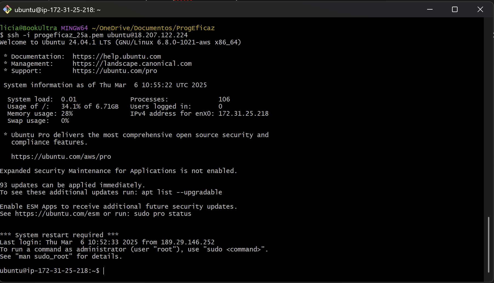
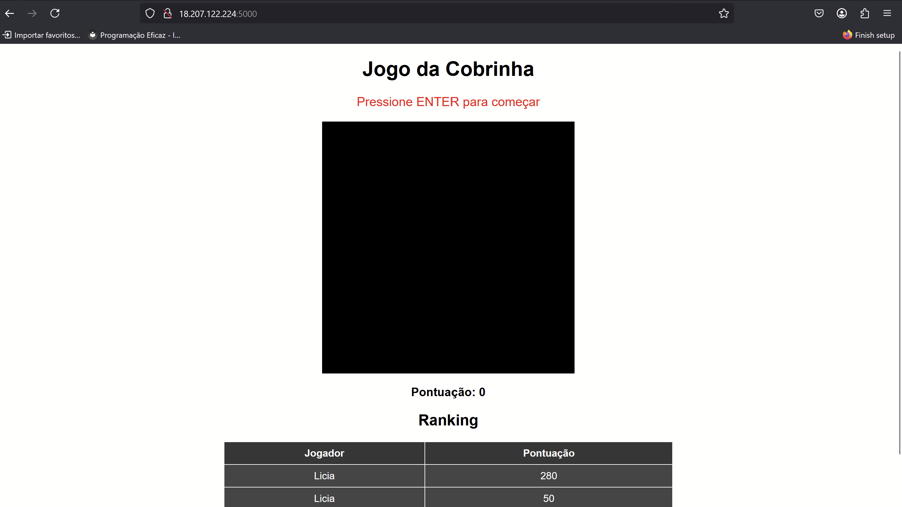

# Deploy do jogo da cobrinha

Vamos subir o jogo da cobrinha na **AWS!**

### Configurar as chaves de acesso a AWS

Faça o download do arquivo .pem enviado por email.

Depois, abra um terminal git bash para acessar a máquina na AWS via SSH com sua **chave pem** e **IP público**:

```
ssh -i "caminho-para-o-seu-arquivo.pem" ubuntu@SEU_IP_PUBLICO

```



### **Atualize e Instale as dependências:**

Agora, instale os pacotes necessários no servidor:

```
sudo apt update && sudo apt upgrade -y

sudo apt install python3 python3-pip python3-venv git nginx ufw -y

```

### **Configure o Firewall (UFW)**

Liberamos apenas portas necessárias para segurança:

```
sudo ufw allow OpenSSH
sudo ufw allow 5000  # Para testar o Flask
sudo ufw allow 'Nginx Full'  # Para a aplicação rodar na porta 80 depois
sudo ufw enable

```

### **Clonar o Código no Servidor**

Agora, vamos trazer o código para o servidor:

```
git clone https://github.com/liciascl/cobrinha
cd cobrinha
```

### 🐍 **Criar o Ambiente Virtual e Instalar Dependências**

Agora, configuramos um ambiente virtual Python para evitar conflitos:

```
python3 -m venv venv
source venv/bin/activate
pip install requeiriments.txt

```

### **Configurar o Gunicorn para Rodar o Flask**

Gunicorn é um servidor **mais eficiente e seguro** do que o Flask padrão.

Criamos um serviço para ele:

```
sudo nano /etc/systemd/system/gunicorn.service

```

Coloque o seguinte conteúdo no editor:

```
[Unit]
Description=Gunicorn instance to serve snake game
After=network.target

[Service]
User=ubuntu
Group=ubuntu
WorkingDirectory=/home/ubuntu/cobrinha
Environment="PATH=/home/ubuntu/cobrinha/venv/bin"
ExecStart=/home/ubuntu/cobrinha/venv/bin/gunicorn -w 3 -b 0.0.0.0:5000 backend:app

[Install]
WantedBy=multi-user.target

```

Salve (`CTRL+X`, `Y`, `Enter`) e inicie:

```
sudo systemctl start gunicorn
sudo systemctl enable gunicorn
sudo systemctl status gunicorn

```

Se aparecer `active (running)`, está funcionando!

### **Configurar o Nginx como Proxy Reverso**

Agora, vamos configurar o **Nginx** para redirecionar a porta `80` para o Gunicorn.

```
sudo nano /etc/nginx/sites-available/snake_game

```

Coloque o seguinte conteúdo alterando **SEU_IP_PUBLICO** pelo IP da sua instância:

```
server {
    listen 80;
    server_name SEU_IP_PUBLICO;

    location / {
        proxy_pass http://127.0.0.1:5000;
        proxy_set_header Host $host;
        proxy_set_header X-Real-IP $remote_addr;
    }
}

```

Salve e ative a configuração:

```
sudo ln -s /etc/nginx/sites-available/snake_game /etc/nginx/sites-enabled
sudo systemctl restart nginx

```

Reinicie a instância:

```
sudo reboot

```

Espere uns 2 minutos até a instância subir novamente e acesse `http://SEU_IP_PUBLICO/5000` no navegador!



Você fez o deploy da aplicação na AWS!

### **Vamos deixar o Servidor Seguro**

acesse novamente a sua instância via terminal git bash

```
ssh -i "caminho-para-o-seu-arquivo.pem" ubuntu@SEU_IP_PUBLICO

```

**Desabilite o acesso direto à porta 5000**

Agora que o Nginx está rodando, bloqueamos o acesso direto à API Flask:

```
sudo ufw deny 5000

```

**Ative o firewall**

```
sudo ufw enable

```

Agora **somente a porta 80 (HTTP) e a 22 (SSH) estarão abertas**, garantindo segurança. Sua aplicação está disponível em alguns instantes, na porta 80, basta acessar [`http://SEU_IP_PUBLICO/`](http://SEU_IP_PUBLICO/) 

# 🚀 **Parabéns! Deploy da aplicação na AWS Finalizada**