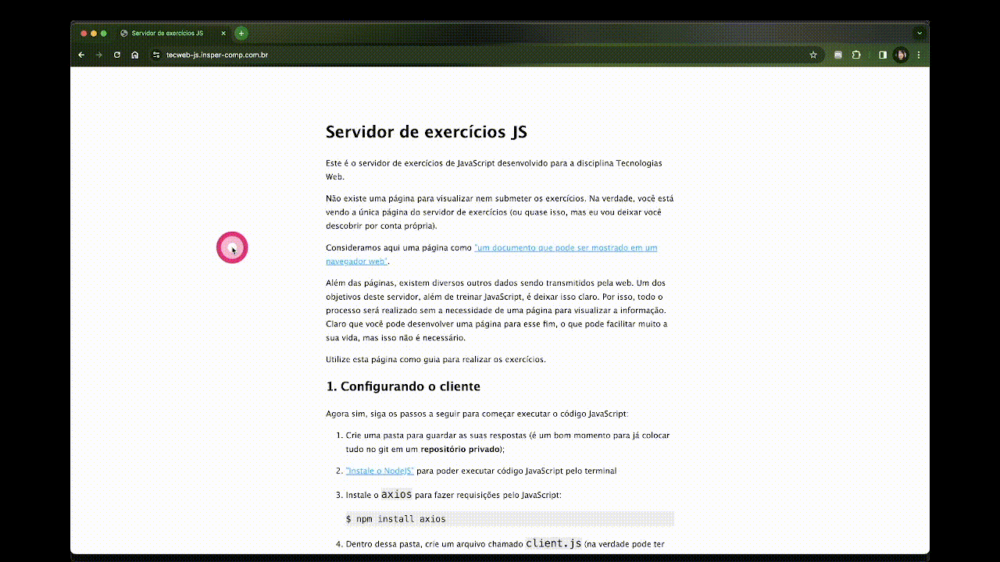

# JavaScript

Existem diversos tutoriais/vídeos/posts muito mais completos sobre JavaScript disponíveis na internet. O objetivo deste handout é oferecer uma breve introdução ao JavaScript para aqueles que não estiverem familiarizados com a linguagem. É esperado que você seja capaz de se aprofundar na linguagem por conta própria a partir deste ponto. Para isso, disponibilizamos o [servidor de exercícios JS](https://tecweb-js.insper-comp.com.br/){:target="_blank"} para você praticar. **Importante:** os exercícios do servidor são considerados como atividade de aula e devem ser entregues até a [data estipulada aqui](../../projetos/aps2.md).

Vamos começar com um aquecimento. Para os exercícios deste handout e do servidor de exercícios JS você pode (e deve) pesquisar o que não souber na internet. Lembre-se de sempre validar as respostas que encontrar em documentações ou páginas confiáveis.

!!! question choice
    Selecione a alternativa verdadeira:

    - [ ] Java e JavaScript são sinônimos;
    - [ ] JavaScript é uma extensão de Java;
    - [x] Java e JavaScript são duas linguagens diferentes;
    - [ ] JavaScript é a versão de Java para web.

    !!! details "Resposta"
        A única relação entre as linguagens Java e JavaScript é a origem do nome. A linguagem JavaScript recebeu o seu nome como um truque de marketing para se aproveitar da popularidade da linguagem Java. A despeito desse fato, as duas linguagens são diferentes e não há muito ganho em tentar fazer uma comparação entre elas.

## Executando código JavaScript

No servidor de exercícios apresentaremos uma maneira de executar código pelo terminal, assim como fazemos com programas em Python. Entretanto, em muitos casos queremos apenas testar alguma expressão ou código simples. Para isso é possível utilizar o próprio navegador para executar o código. Basta abrir o navegador de sua preferência e abrir o *developer tools*. Nele há um console no qual é possível executar código JavaScript diretamente.

!!! tip "Developer Tool"
    Cada navegador possui um atalho para abrir o *developer tools*. No link a seguir você encontra instruções para encontrar o *developer tools* no navegado Google Chrome: [Abrir o Chrome DevTools](https://developer.chrome.com/docs/devtools/open?hl=pt-br){:target="_blank"}

<figure markdown="span">
  { width="80%" }
  <figcaption>Abrir o Chrome DevTools</figcaption>
</figure>


!!! example
    Abra o *developer tools* do seu navegador e execute o código a seguir no console:

    ```javascript
    alert("Olá mundo!")
    ```

## A sintaxe do JavaScript

Vamos começar pela sintaxe da linguagem. Novamente, existem guias muito mais completos, então vamos diretamente para um resumo, sem muitas explicações. Você deve se aprofundar em cada tópico conforme a necessidade surgir.

### Imprimindo strings no terminal

O JavaScript foi desenvolvido originalmente para ser executado no navegador. Por esse motivo, o equivalente ao `#!python print` do Python é o comando `#!javascript console.log`. Ou seja, vamos fazer o log de uma string no console.

!!! example
    Execute o código a seguir no console:

    ```javascript
    console.log("Olá mundo!")
    ```

### Strings

Assim como em Python, strings podem ser delimitadas por aspas simples ou duplas. Mas existe uma terceira maneira de definir strings que é equivalente a uma junção das strings de múltiplas linhas (`'''`) com [f-strings](https://realpython.com/python-f-strings/) do Python. Esse terceiro tipo de string é conhecido como **template literal** e é definido com o acento grave (`).

!!! example
    Teste no console o código a seguir (por enquanto basta você saber que o `#!javascript let` é utilizado para declarar uma nova variável):

    ```javascript
    let nome = "Insper"
    let mensagem = `Olá ${nome},

    Esta é uma string com múltiplas linhas.`
    console.log(mensagem)
    ```

!!! question choice
    Considere o código a seguir e responda qual será a saída no terminal:

    ```javascript
    let a = 'A'
    let b = "${a}"
    let c = `${a}`

    console.log(b);
    console.log(c);
    ```

    - [ ] `#!javascript ${a}` e `#!javascript ${a}`;
    - [ ] `#!javascript A` e `#!javascript A`;
    - [x] `#!javascript ${a}` e `#!javascript A`;
    - [ ] `#!javascript A` e `#!javascript ${a}`.

    !!! details "Resposta"
        Template literals são indicadas com o acento grave (`). Se utilizarmos aspas (' ou "), o JavaScript não realizará nenhum processamento. Ou seja, a string será aquela exata sequência de caracteres.

### Blocos de código

Em JavaScript, assim como em muitas outras linguagens, blocos de código são identificados com chaves. Entretanto, as chaves podem ser dispensadas se o bloco possuir apenas uma linha. Neste aspecto, o Python é uma exceção à regra, pois os blocos são identificados com indentações. Aproveitando, em JavaScript é mais comum utilizarmos indentações de 2 espaços.

!!! question choice
    Considere os códigos abaixo:

    a.
    ```javascript
    let a = 2;
    if (a > 0)
      console.log(`A variável a vale ${a}
    a é um número positivo`);
    if (a < 0)
      console.log(`A variável a vale ${a}
    a é um número negativo`);
    ```

    b.
    ```javascript
    let a = 2;
    if (a > 0)
      console.log(`A variável a vale ${a}`)
      console.log(`a é um número positivo`)
    if (a < 0)
      console.log(`A variável a vale ${a}`)
      console.log(`a é um número negativo`)
    ```

    c.
    ```javascript
    let a = 2;
    if (a > 0) {
      console.log(`A variável a vale ${a}`)
      console.log(`a é um número positivo`)
    }
    if (a < 0) {
      console.log(`A variável a vale ${a}`)
      console.log(`a é um número negativo`)
    }
    ```

    Qual dos códigos acima gera uma saída diferente no console:

    - [ ] a
    - [x] b
    - [ ] c

    !!! details "Resposta"
        Blocos em JavaScript são definidos por chaves. No item b, como não há chaves definindo o bloco, apenas a linha seguinte ao `#!javascript if` é considerada como parte do seu bloco. Assim, o segundo e quarto `#!javascript console.log` sempre serão executados.

### Funções

Existem duas maneiras de definir funções em JavaScript. A primeira é muito parecida com o que fazemos em Python, mas com `#!javascript function` ao invés de `#!python def`:

```javascript
function minhaFuncao(a, b) {
  return a + b
}

console.log(minhaFuncao(12, 30))
```

A segunda maneira é chamada de *arrow function*, que define uma função que pode ser armazenada em uma variável:

!!! example
    Teste o código a seguir (não se preocupe com o `#!javascript const`, nós vamos explicá-lo mais para a frente):

    ```javascript
    const minhaFuncao = (a, b) => a + b;
    console.log(minhaFuncao); // A função é um objeto armazenado na variável minhaFuncao
    console.log(minhaFuncao(10, 20));

    const aMesmaFuncao = minhaFuncao;
    console.log(aMesmaFuncao(30, 40));
    ```

!!! question choice
    Qual é o resultado do código a seguir?

    ```javascript
    let funcaoA = (a, b) => a + b;
    let funcaoB = (a, b) => a - b;
    funcaoA = funcaoB;
    let funcaoC = (f, a, b) => f(a, b);
    console.log(funcaoC(funcaoA, 2, 3));
    console.log(funcaoC(funcaoB, 2, 3));
    ```

    - [x] `#!javascript -1` e `#!javascript -1`;
    - [ ] `#!javascript -1` e `#!javascript 5`;
    - [ ] `#!javascript 5` e `#!javascript -1`;
    - [ ] `#!javascript 5` e `#!javascript 5`.

    !!! details "Resposta"
        A variável `#!javascript funcaoA` recebe o objeto armazenado na variável `#!javascript funcaoB`, portanto ambas guardam a função que subtrai os elementos. A `#!javascript funcaoC` recebe uma função e mais dois argumentos e devolve o resultado da aplicação da função aos dois argumentos.

### O ponto e vírgula

Em Python não utilizamos ponto e vírgula (`;`) no final das linhas. Em Java o ponto e vírgula é obrigatório. Em JavaScript o ponto e vírgula é opcional, pois a engine os insere automaticamente. **Entretanto, você não deve confiar na inserção automática do ponto e vírgula, pois resultados inesperados podem ocorrer**.

!!! example
    Teste o código a seguir no console:

    ```javascript
    function montaNomeCompleto(nome, sobrenome) {
        return
        `
        ${nome} ${sobrenome}
        `
    }
    console.log(montaNomeCompleto("Fulano", "Silva"))
    ```

No código acima, o ponto e vírgula foi inserido automaticamente após o `#!javascript return`.

!!! example
    Para corrigir o código acima, modifique-o da seguinte maneira:

    ```javascript
    function montaNomeCompleto(nome, sobrenome) {
        return `
        ${nome} ${sobrenome}
        `;
    }
    console.log(montaNomeCompleto("Fulano", "Silva"))
    ```

### Escopo de variáveis

Existem 4 maneiras de declarar variáveis em JavaScript. Se definirmos uma variável como fazemos normalmente em Python, a variável será global.

!!! example
    Teste o código a seguir no console:

    ```javascript
    a = 10;

    function modificaVariavelGlobal() {
      a = 20;
      b = 30;
    }

    modificaVariavelGlobal();
    console.log(a);
    console.log(b);
    ```

A segunda maneira de declarar variáveis é utilizando o `#!javascript var`. Variáveis declaradas com `#!javascript var` são globais apenas quando declaradas no contexto global (fora das funções):

!!! tip
    Recarregue a página do navegador para que as variáveis dos exemplos anteriores que você criou não influencie no comportamento do próximo exemplo.

!!! example
    Teste o código a seguir:

    ```javascript
    console.log(a) // A variável a já existe, apesar de ter sido declarada depois. Isso só acontece porque ela foi declarada com var.
    var a = 10;

    function modificaVariavelGlobal() {
      a = 20;
      var b = 30;
    }

    modificaVariavelGlobal();
    console.log(a); // Esta variável é a mesma fora e dentro da função
    console.log(b); // Esta variável não existe fora da função, então ocorrerá um erro
    ```

A terceira maneira é utilizando o `#!javascript let`, que declara uma variável local (em geral é esse tipo de variável que você vai usar em seu código):

!!! tip
    Recarregue a página do navegador para que as variáveis dos exemplos anteriores que você criou não influencie no comportamento do próximo exemplo.

!!! example
    Teste o código a seguir (se você colocar o `#!javascript console.log(a)` no começo do código - como no código acima - ocorrerá um erro):

    ```javascript
    let a = 10;

    function modificaVariavelGlobal() {
      a += 10;
      let b = 30;
    }

    modificaVariavelGlobal();
    console.log(a); // Esta variável é a mesma fora e dentro da função
    console.log(b); // Esta variável não existe fora da função, então ocorrerá um erro
    ```

A última maneira é utilizando o `#!javascript const`, que declara uma variável que não pode receber outro valor (os seus atributos ainda podem ser modificados).

!!! tip
    Recarregue a página do navegador para que as variáveis dos exemplos anteriores que você criou não influencie no comportamento do próximo exemplo.

!!! example
    Teste o código a seguir:

    ```javascript
    const a = 10;

    console.log(a); // Esta variável é a mesma fora e dentro da função

    a = 20; // Erro, pois a não pode ser modificada
    ```

!!! question choice
    Qual é o resultado do código a seguir?

    ```javascript
    let a = 10;
    const b = 20;

    const modifica = () => {
        const outraModificacao = () => {
            let a = 100;
        }
        outraModificacao();

        a += 5;
        let b = 30;
    }

    modifica();
    console.log(a);
    console.log(b);
    ```

    - [ ] `#!javascript 10` e `#!javascript 20`;
    - [ ] `#!javascript 15` e `#!javascript 30`;
    - [ ] `#!javascript 10` e `#!javascript 30`;
    - [x] `#!javascript 15` e `#!javascript 20`;
    - [ ] `#!javascript 100` e `#!javascript 20`;
    - [ ] `#!javascript 105` e `#!javascript 30`;
    - [ ] `#!javascript 100` e `#!javascript 30`;
    - [ ] `#!javascript 105` e `#!javascript 20`;
    - [ ] Ocorrerá um erro.

    !!! details "Resposta"
        A variável `#!javascript a` está disponível dentro da função `#!javascript modifica` e o seu valor é acrescentado em `#!javascript 5`.

        Dentro da função `#!javascript outraModificacao` é declarada uma **nova variável** `#!javascript a`, que só está disponível dentro dela mesma, pois seu escopo é mais específico.

        O mesmo ocorre com a variável `#!javascript b` dentro da função `#!javascript modifica`. Por esse motivo, não ocorre erro ao definir `#!javascript b = 10`, pois a constante `#!javascript b` declarada fora da função não está sendo modificada na função `#!javascript modifica`.

### Operador de igualdade

Os operadores `#!javascript >`, `#!javascript <`, `#!javascript >=`, `#!javascript <=` funcionam da mesma forma que no Python. Entretanto, em JavaScript existe também o operador `#!javascript ===`, que é o operador de igualdade. Vamos ver um exemplo:

!!! example
    Teste no console:

    ```javascript
    console.log('2' == 2); // true
    console.log('2' === 2); // false
    console.log('2' != 2); // false
    console.log('2' !== 2); // true
    ```

O `#!javascript ==` e `#!javascript !=` são comparadores "fracos". Eles verificam se os valores são iguais fazendo algumas concessões para tipos diferentes. O `#!javascript ===` e `#!javascript !==`, além de verificarem os valores, também comparam os tipos.

### Arrays e um pouco de programação funcional

A sintaxe de arrays é muito semelhante à de listas em Python. Em JavaScript é muito comum o uso de princípios de programação funcional. Por exemplo, podemos utilizar o método `#!javascript map`, que devolve um novo array com o resultado da aplicação de uma função a todos os elementos do array original. Por exemplo:

```javascript
let numeros = [1, 2, 3, 4];
let dobro = numeros.map((n) => 2 * n); // O argumento do map é uma função que recebe um número e devolve o seu dobro
console.log(dobro);
```

Temos também o `#!javascript reduce`, que recebe uma função que recebe dois argumentos e um valor inicial. O `#!javascript reduce` e percorre o array aplicando a função passando o valor atual e o resultado da aplicação anterior da função. Por exemplo:

```javascript
let numeros = [1, 2, 3, 4];
let somaMaisVinte = numeros.reduce((a, b) => a + b, 20); // 20 é o valor que será passado na primeira chamada da função
console.log(somaMaisVinte);
```

O método `#!javascript filter` recebe uma função que recebe um número e devolve um booleano que indica se aquele elemento deve estar presente no resultado ou não. O resultado da aplicação do `#!javascript filter` é um novo array contendo apenas os elementos para os quais a função devolveu `#!javascript true`. Por exemplo:

```javascript
let numeros = [1, 2, 3, 4];
let pares = numeros.filter((n) => n % 2 === 0);
console.log(pares)
```

!!! question choice
    Qual é o resultado do código a seguir?

    ```javascript
    let resultado = [1, 2, 3, 4, 5, 6, 7, 8, 9, 10].map(
      (a) => a + 3).filter(
      (b) => b % 2 === 0).reduce(
      (c, d) => c + d, 0);
    console.log(resultado);
    ```

    - [ ] `#!javascript [4, 5, 6, 7, 8, 9, 10, 11, 12, 13]`;
    - [ ] `#!javascript [2, 4, 6, 8, 10]`;
    - [ ] `#!javascript [4, 6, 8, 10, 12]`;
    - [ ] `#!javascript 30`;
    - [x] `#!javascript 40`;
    - [ ] `#!javascript 45`.

    !!! details "Resposta"
        A aplicação do `#!javascript map` resultará no array `#!javascript [4, 5, 6, 7, 8, 9, 10, 11, 12, 13]`. Nesse array será aplicado o `#!javascript filter`, filtrando apenas os números pares, resultando em `#!javascript [4, 6, 8, 10, 12]`. Finalmente, o `#!javascript reduce` realizará a soma de todos os elementos, começando com a soma igual a zero.

### Objetos

Em JavaScript não existe o conceito de classes (na verdade o conceito [até existe](https://developer.mozilla.org/en-US/docs/Web/JavaScript/Reference/Classes), mas é um pouco diferente do que estamos acostumados) e nós lidamos diretamente com objetos e a sua sintaxe é muito parecida com dicionários em Python. Por exemplo:

```javascript
let cachorro = {
    nome: "Floquinho",
    idade: 5,
    temDono: true,
};
cachorro.idade++; // Equivalente a cachorro.idade += 1;
cachorro["idade"]++; // As duas sintaxes são equivalentes
console.log(cachorro);
```

!!! question choice
    Quais dos códigos abaixo resultarão em erro?

    a.
    ```javascript
    let objeto = {};
    objeto.atributo = "Pode isso?";
    console.log(objeto.atributo);
    ```

    b.
    ```javascript
    const objeto = {};
    objeto["atributo"] = "E isso (olha o const lá)?";
    console.log(objeto["atributo"]);
    ```

    c.
    ```javascript
    const objeto = {atributo: "valor inicial"};
    objeto.atributo = "Pode mudar objeto const?";
    console.log(objeto.atributo);
    ```

    d.
    ```javascript
    let objeto = {atributo: "outro valor inicial"};
    objeto["atributo"] = "Agora pode?";
    console.log(objeto["atributo"]);
    ```

    - [x] Nenhum;
    - [ ] Apenas a;
    - [ ] Apenas b;
    - [ ] Apenas c;
    - [ ] Apenas d;
    - [ ] Apenas a e d;
    - [ ] Apenas b e c;
    - [ ] Apenas a e c;
    - [ ] Apenas b e d;
    - [ ] Apenas a e b;
    - [ ] Apenas c e d;
    - [ ] Todos.

    !!! details "Resposta"
        Variáveis `#!javascript const` não podem receber outro valor, mas todos os trechos de código acima modificam um atributo do objeto armazenado naquela variável. Assim, nenhum deles modifica a variável em si e então todos eles funcionam.

## Operações assíncronas

Operações assíncronas são muito comuns quando estamos trabalhando na web e por isso merecem uma seção à parte. Na web é importante que a sua página seja carregada rapidamente. Para isso, uma técnica comum é carregar o essencial e depois carregar os dados necessários conforme a demanda. Assim, é necessário realizar operações demoradas, como requisições para algum servidor. Para não bloquear o processamento, o JavaScript disponibiliza um tipo especial de função, a função assíncrona.

!!! example
    Teste o código abaixo:

    ```javascript
    async function processaString(nome) {
    // Exemplo artificial. Isso na verdade é instantâneo.
      return `Olá ${nome}`;
    }
    let oQueEleDevolveu = processaString("Fulano");
    console.log(oQueEleDevolveu);
    ```

A função não devolveu a string `#!javascript "Olá Fulano"` e sim uma coisa chamada *promise*. Uma *promise* é um objeto que pode ser utilizado para esperar o resultado de uma operação demorada. Você pode, por exemplo, esperar o resultado da *promise* com:

```javascript
async function processaString(nome) {
// Exemplo artificial. Isso na verdade é instantâneo.
  return `Olá ${nome}`;
}
let promessa = processaString("Fulano");
let resultado = await promessa; // O código vai ficar parado nesta linha até a operação ser concluida
console.log(resultado);
```

Vamos trabalhar com um exemplo um pouco mais complexo. A função assíncrona `#!javascript fetch` pode ser utilizada para realizar uma requisição.

!!! example
    Teste o código abaixo:

    ```javascript
    let promesa = fetch("https://catfact.ninja/fact");
    console.log(promesa);
    let resultado = await promesa;
    console.log(resultado);
    let jsonDaResposta = resultado.json(); // O resultado possui um método json que carrega o json recebido na resposta
    console.log(jsonDaResposta); // Ele também é uma promessa, pois precisa processar o texto para extrair o json
    let objetoDaResposta = await jsonDaResposta;
    console.log(objetoDaResposta.fact); // Agora sim!
    ```

Hmmm... ainda não vi vantagem nesse tal de `#!javascript async/await`. Vamos lá. Agora começa a ficar mais interessante. A *promise* possui um método `#!javascript then` que recebe uma função que será aplicada **quando a promessa for cumprida**. Reescrevendo o exemplo acima:

```javascript
let objetoDaResposta = await fetch("https://catfact.ninja/fact").then(
  ((resultado) => resultado.json()))
console.log(objetoDaResposta.fact);
```

Mas ainda dá pra melhorar. Nós podemos montar uma sequência de `#!javascript then`, pois ele também devolve uma *promise*:

!!! example
    Teste o código abaixo:

    ```javascript
    fetch("https://catfact.ninja/fact").then(
      ((resultado) => resultado.json())).then(
      ((objetoDaResposta) => console.log(objetoDaResposta.fact)))
    console.log("Esse console.log vai aparecer antes do console.log da sequência de promises acima");
    ```

No exemplo acima vemos uma vantagem de utilizar *promises*: você registra o que deve ser feito quando a promessa for cumprida e continuar executando o resto do código.

!!! question choice
    Qual será a ordem impressa no console?

    ```javascript
    fetch("https://catfact.ninja/fact").then(
      ((resultado) => resultado.json())).then(
      ((objetoDaResposta) => console.log("Resposta 1 OK")));

    fetch("https://catfact.ninja/fact").then(
      ((resultado) => resultado.json())).then(
      ((objetoDaResposta) => console.log("Resposta 2 OK")));
    ```

    - [ ] `#!javascript Resposta 1 OK` e depois `#!javascript Resposta 2 OK`;
    - [ ] `#!javascript Resposta 2 OK` e depois `#!javascript Resposta 1 OK`;
    - [x] Qualquer uma das anteriores pode ocorrer.

    !!! details "Resposta"
        Não temos controle de quando as promessas serão cumpridas. É possível que uma requisição demore mais do que a outra. Portanto qualquer ordem é possível.

!!! question choice
    Qual será a ordem impressa no console?

    ```javascript
    fetch("https://catfact.ninja/fact").then(
      ((resultado) => resultado.json())).then(
      ((objetoDaResposta) => console.log("Resposta 1 OK"))).then(
      () => fetch("https://catfact.ninja/fact")).then(
      ((resultado) => resultado.json())).then(
      ((objetoDaResposta) => console.log("Resposta 2 OK")));
    ```

    - [x] `#!javascript Resposta 1 OK` e depois `#!javascript Resposta 2 OK`;
    - [ ] `#!javascript Resposta 2 OK` e depois `#!javascript Resposta 1 OK`;
    - [ ] Qualquer uma das anteriores pode ocorrer.

    !!! details "Resposta"
        O segundo `#!javascript fetch` só é iniciado depois que a *promise* anterior for concluída. Portanto, ele só será iniciado depois do primeiro `#!javascript console.log`.

## Agora que você já sabe tudo sobre javascript...

... podemos seguir para o próximo conceito, [Requisições Assíncronas](./assync.md).

## Referências

- [Python vs JavaScript for Pythonistas](https://realpython.com/python-vs-javascript/)
- [JavaScript Guide](https://developer.mozilla.org/en-US/docs/Web/JavaScript/Guide)