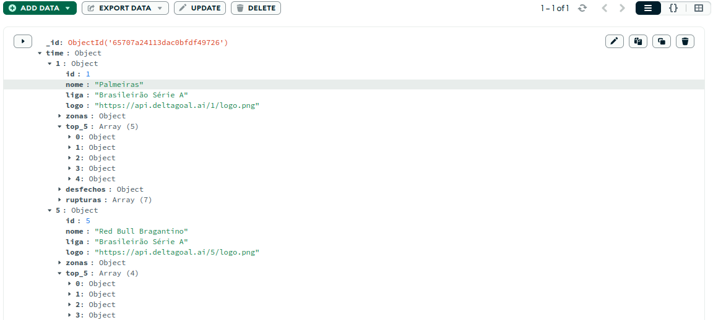
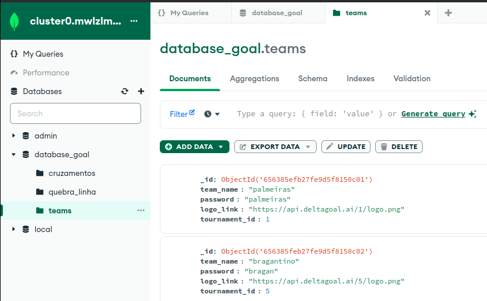

# Mongo Data Base: Conceitos Básicos

Responsável: Sarti

Com o MySQL, interagimos com bancos de dados relacionais, e o MongoDB será nossa abordagem para bancos de dados não relacionais.

# Tipos de Bancos de Dados

Existem múltiplos tipos de bancos de dados, cada um trazendo suas vantagens e desvantagens, sendo ideal para um ou outro uso. Dentre esses vários tipos de bancos, já trabalhamos com o MySQL, que é uma abordagem de bancos de dados relacionais (SQL), na qual os bancos de dados consistentes de tabelas. Podemos salvar o que quisermos em nosso banco de dados, porém devemos salvár como uma tabela, semelhante ao Excel em sua estrutura.

O MongoDB, por sua vez, é a abordagem mais popular de banco de dados não relacionais (NoSQL), que é basicamente um banco de dados consistente de documentos, e não de tabelas.

### Como assim “Consistente de documentos?

Quando falamos que o MongoDB é consistente de documentos, queremos dizer que o banco de dados, ao invés de armazenar tabelas, ele armazena documentos em formato de arquivos de texto. No caso do MongoDB, em formato JSON. Sim, o mesmo JSON que utilizamos para toda requisição REST e que é extremamente similar a um dicionário do Python.

## Vantagens de um Banco de Dados não relacional:

Por armazenarmos documentos JSON, que para facilitar a compreensão irei me referir como "dicionários" (apesar de incorreto), nós temos muito mais facilidade de ler e armazenar dados conforme necessário, pois tratando-se de um dicionário, não precisamos declarar os campos de antemão como em uma tabela, onde precisamos declarar as colunas.

Queremos salvar uma informação X? Salve. Quer que um usuário não tenha email e os outros tenham? Pois crie o usuário sem. Quer um dicionário de dicionários? Perfeito.

Esta é a maior vantagem do MongoDB: simplicidade. Salvamos o que quisermos, como quisermos, quando quisermos, no maior "freestyle" possível, da maneira que acharmos melhor. Isso inclusive é demonstrado nas queries do MongoDB, que são muito mais simples do que as queries de SQL.

## Desvantagens de um Banco de Dados não relacional:

Apesar de parecer, e realmente ser, uma maravilha desenvolver um projeto com MongoDB devido à sua simplicidade, isso também é revertido em sua maior desvantagem. É muito fácil criarmos bagunça e desorganização no banco de dados, por isso, simplicidade não significa que devemos parar de nos preocupar com a estrutura de dados do nosso sistema.

Exemplo de dicionario (arquivo JSON) armazenado pelo Mongo.

# Estrutura do Mongo

O MongoDB é dedicado a armazenar documentos, e isto é feito por meio de uma hierarquia de interações dentro de um mesmo cluster (projeto). A estrutura do MongoDB que configuramos em nosso MongoDB Atlas consiste de:

- Cluster: O nosso projeto, um agrupado de todos os bancos de dados do projeto.
- Databases: O banco de dados que armazena as collections do projeto.
- Collections: Como se fossem pastas de arquivos no nosso computador, que armazenam os dicionarios.
- Json/Arquivos (dicionarios): As informações armazenadas no banco de dados.

Imagem do Cluster0, com suas databases e as collections da database “database_goal”.