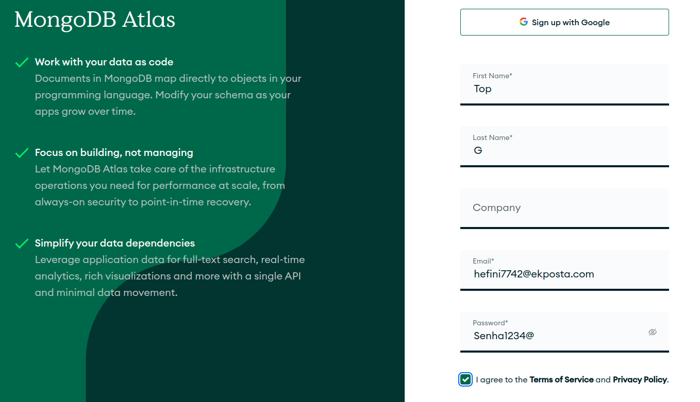
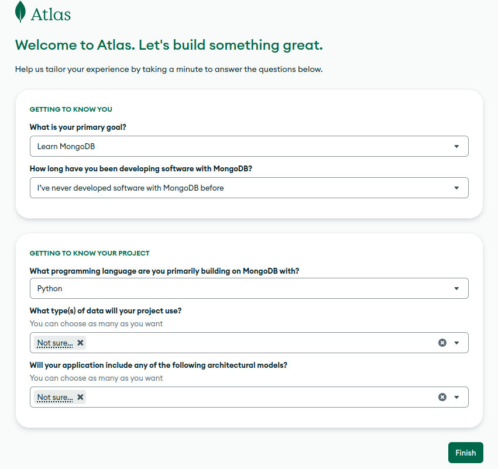
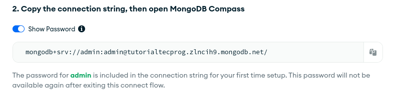
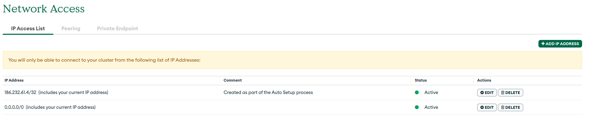
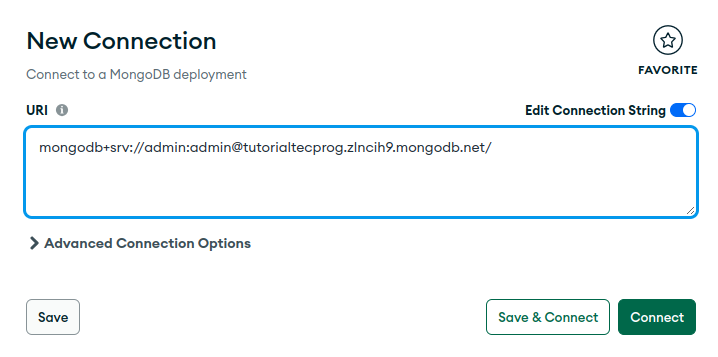
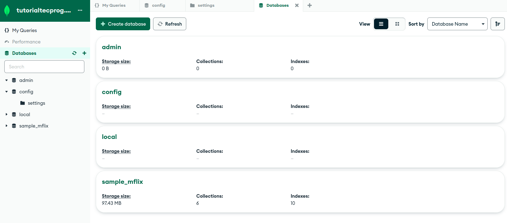
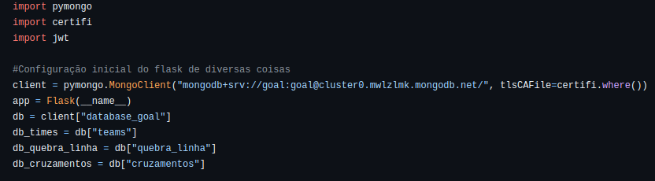

# Mongo Database: Configuração

Responsável: Sarti

# Criação de Conta

O MongoDB é um tipo de banco de dados que pode ser utilizado localmente ou via nuvem, assim como o MySQL, e por isso estaremos utilizando a sua abordagem em nuvem gratuita, por meio do MongoDB Atlas. Para criarmos nosso banco de dados, primeiro acessem o link do Atlas ([https://www.mongodb.com/cloud/atlas/register](https://www.mongodb.com/cloud/atlas/register){:target="_blank"}) e crie sua conta.

(O email utilizado é de um gerador, substitua todas as informações por informações validas)

# Criando Nosso Banco de Dados

Após criar a conta e verificar seu e-mail, será pedido para preencher um formulário. As informações fornecidas não devem influenciar nas etapas seguintes do processo, mas para referência, segue como sugiro que o formulário seja preenchido:

Após preencher o formulário, você será redirecionado para a página de criação de clusters, que é, resumidamente, nosso banco de dados. Selecione a opção M0 (gratuita), servidor São Paulo e provedor AWS. O nome fica a sua escolha. Após isso, clique em "Create Deployment".

Após isso, será pedido para criarmos um usuário de administração para nossa base de dados. Utilize qualquer informação desejada. Eu utilizo "admin" como usuário e "admin" como senha. Clique em "Choose connection method" e selecione Compass (voltaremos aqui mais tarde) e copie a Connection String fornecida. Salve-a para uso posterior.

## Liberando Acesso

Antes de prosseguirmos para o MongoDB Compass, utilize a barra lateral para acessar a aba "Network Access". Nesta aba, clique em "Add IP Address" e selecione "Allow Access From Anywhere". Por padrão, nosso cluster só é acessível por IPs restritos (importante para aplicações comerciais), mas para nós isso apenas atrapalha, então liberamos o acesso por qualquer IP.

# Mongo Compass

### Baixando o Compass

Para acessarmos nosso banco de dados no Atlas, utilizamos uma ferramenta chamada MongoDB Compass (podemos fazer um paralelo no MySQL com o MySQL Workbench). Para baixar, basta acessar o link da página de download e baixar a versão que mais se adequar ao seu caso ([https://www.mongodb.com/try/download/compass](https://www.mongodb.com/try/download/compass)).

Observação: A versão pode variar dependendo do sistema operacional e de qual versão você deseja utilizar, mas via de regra utilizaremos a opção "MongoDB Compass GUI". Tente baixá-la e, se por algum motivo não conseguir, chame um professor ou especialista.

### Conectando ao Compass

Ao baixar e abrir o compass, será pedido para fazer a conexão a alguma base de dados. Para isso, basta inserir o link de conexão copiado anteriormente e se connectar:

Pronto, após isso você já estará connectado ao seu cluster, com acesso à todas as Databases e Collections.

<!-- # Conectando ao Python

Para conectarmos nosso banco de dados ao MongoDB, devemos utilizar uma das seguintes bibliotecas: "pymongo" ou "flask-pymongo". Ambas podem ser baixadas via pip. Baixe APENAS UMA delas.

Observação: Existem outras bibliotecas também, como a Djongo (focada em conectar Django com MongoDB), mas para fins do curso, nos interessa apenas estas 2 bibliotecas, sendo pymongo uma versão universal de Python com MongoDB e flask-pymongo uma versão levemente adaptada para se encaixar melhor com Flask (diferenças mínimas). Utilize a que preferir.

Após baixar a biblioteca de sua escolha, devemos fazer a conexão via string. Segue um código exemplo utilizando a biblioteca pymongo, retirado da "Sprint Session 2023.2 - Delta Goal Grupo 1":

Ignore os códigos relacionados à certifi e jwt. -->