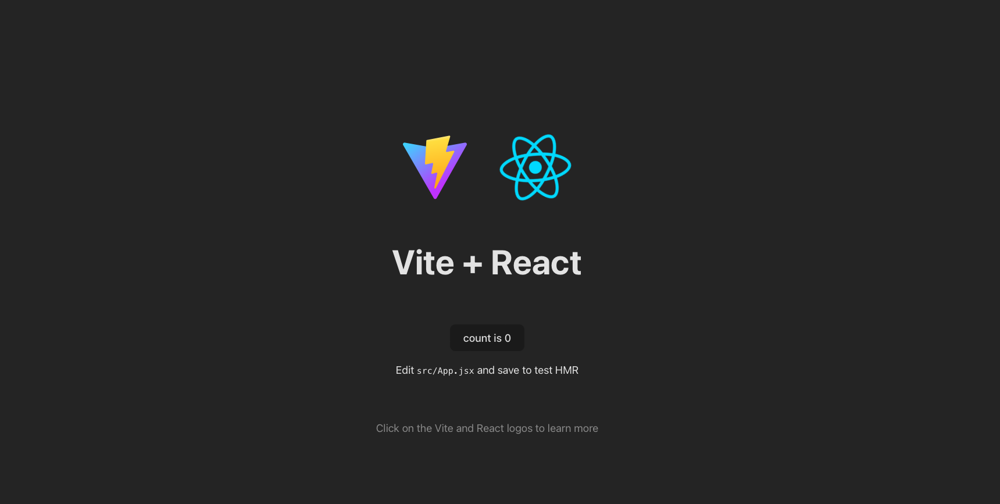

# React

O objetivo deste handout é que você tenha um primeiro contato com o React. Ao final do handout você terá alguma ideia de qual é a "cara" de um app React. Para saber mais sobre React veja o [tutorial oficial do React](https://react.dev/learn/tutorial-tic-tac-toe){:target="_blank"} ou o tutorial disponibilizado pelo Mozilla [Tutorial React by Mozilla](https://developer.mozilla.org/en-US/docs/Learn/Tools_and_testing/Client-side_JavaScript_frameworks/React_getting_started){:target="_blank"}.

!!! danger "Importante"
    Nem todo código deste handout é JavaScript puro. Algumas (muitas) coisas são específicas do React e não funcionarão fora desse contexto.

!!! danger "Importante 2"
    Quando você for pesquisar no Google sobre React, você vai encontrar muito material utilizando classes. Essa é a uma maneira alternativa de se utilizar o React. O uso de componentes funcionais (que veremos neste handout) tem se tornado cada vez mais comum, mas é importante saber que existem essas duas alternativas para não utilizar soluções que não funcionarão para o seu caso.

## Setup do React

1. Garanta que você possui uma versão recente do [Node.js](https://nodejs.org/en/){:target="_blank"}. Se você fez o servidor de exercícios JS você já deve ter uma versão recente do Node.js.
2. Existem diversas formas de criar um projeto React. Neste handout vamos utilizar o [Vite](https://vitejs.dev/){:target="_blank"}, para isso, abra um terminal e navegue até a pasta onde você deseja criar o projeto. Não é necessário criar uma pasta para o projeto, pois o comando a seguir já cria uma pasta com o nome do projeto. 
    Rode o comando abaixo:
    ```
    npm create vite@latest notes-frontend -- --template react
    ```
    Nada deveria ser perguntado, mas se você tiver que escolher opções, escolha as opções `React` e `JavaScript`.

4. A estrutura de arquivos dentro do projeto será:
  
      ```
      notes-frontend
      ├── node_modules
      ├── public
      │   └── vite.svg
      ├── src
      │   ├── assets
      │   │   └── react.svg
      │   ├── App.css
      │   ├── App.jsx
      │   ├── index.css
      │   └── main.jsx
      ├── .eslintrc.cjs
      ├── .gitignore
      ├── index.html
      ├── package-lock.json
      ├── package.json
      ├── README.md
      └── vite.config.js
      ```

    ??? info "Breve descrição das pastas e arquivos" 
        - `node_modules`: pasta com as dependências do projeto;
        - `public`: pasta com arquivos estáticos, como imagens e o arquivo `index.html`;
        - `src`: pasta com os arquivos do projeto;
        - `App.css`: arquivo de estilos do componente principal;
        - `App.jsx`: arquivo do componente principal;
        - `index.css`: arquivo de estilos do arquivo `index.html`;
        - `index.jsx`: arquivo que renderiza o componente principal;
        - `.gitignore`: arquivo para ignorar arquivos e pastas no git;
        - `package.json`: arquivo com informações do projeto e dependências;
        - `package-lock.json`: arquivo com informações das dependências;
        - `README.md`: arquivo com informações sobre o projeto;
        - `vite.config.js`: arquivo de configuração do Vite.
    
    Foram criados vários arquivos e pastas, mas neste momento vamos focar em apenas alguns deles:

    O projeto possui somente um arquivo HTML, o `index.html`, que é o ponto de entrada da aplicação. Se olharmos o conteúdo desse arquivo, veremos que ele possui uma única tag `<div id="root"></div>`. Essa tag é o ponto de entrada da aplicação React. O React irá renderizar os componentes dentro dessa tag.

    [**Single Page Applications** (SPA)](){:target="_blank"} são aplicações que possuem uma única página HTML e que são atualizadas dinamicamente.

    O arquivo `src/App.jsx` é o componente principal da aplicação. Ele é o componente que será renderizado dentro da tag `<div id="root"></div>` do arquivo `index.html`. O arquivo `src/index.jsx` é o arquivo que renderiza o componente principal. Ele importa o componente principal e o renderiza dentro da tag `<div id="root"></div>`.

    O arquivo `src/App.css` é o arquivo de estilos do componente principal. Ele é importado no arquivo `src/App.jsx` e é aplicado ao componente principal.  

4. Rode os comandos abaixo para entrar na pasta do projeto, instalar as dependências e rodar o projeto:
    ```bash
    cd notes-frontend
    npm install
    npm run dev
    ```

    <figure markdown="span">
      { width="50%" }
      <figcaption>Página inicial</figcaption>
    </figure>

## Criando Componentes

Vamos começar criando um componente para o `card`.

[Criando Componentes](./parte-01-componentes.md){ .md-button .md-button--primary }