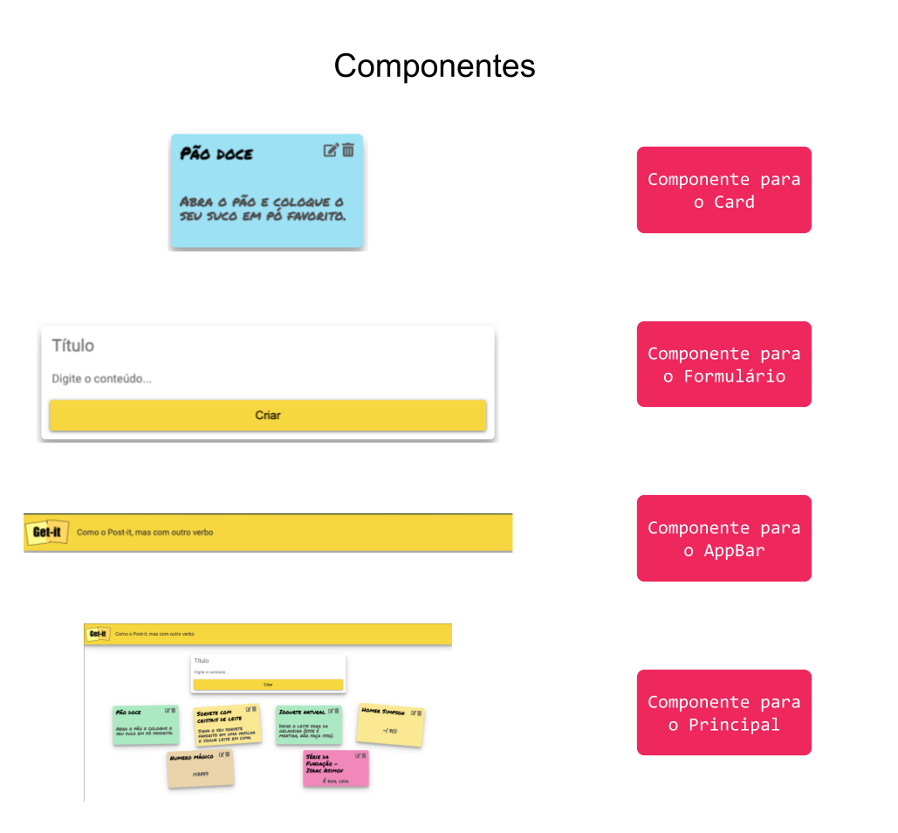
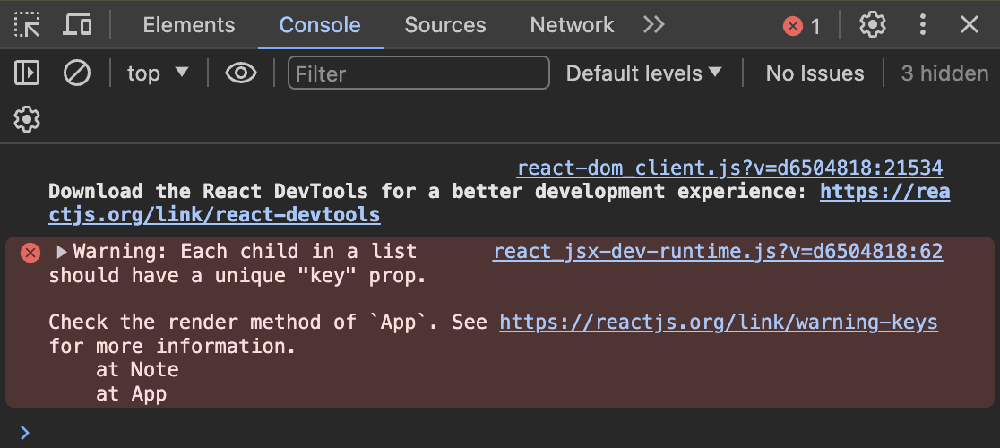

Vamos começar fazendo alterações para começarmos a refazer o Projeto 1 utilizando Flask + React.

Componentes são a base do React, a extensão `.JSX` (JavaScript XML, JavaScript Syntax eXtension) é uma extensão de arquivo usada por arquivos JavaScript que permitem a mistura de HTML e JavaScript. Os componentes são funções JavaScript que retornam HTML. 

Poderíamos escrever o HTML diretamente no arquivo `src/App.jsx`, mas isso não seria muito prático. 

Em nosso projeto, podemos pensar em quebrar a aplicação em componentes menores. Por exemplo, podemos criar um componente para representar uma `card`, `formulario`, `appbar` e assim por diante.

<figure markdown="span">
  { width="70%" }
  <figcaption>Componentes</figcaption>
</figure>

Vamos criar nosso primeiro componente, o `Note`. Ele será responsável por mostrar uma anotação.

1. Crie o arquivo `src/components/Note/index.jsx` (você vai precisar criar algumas pastas) no seu projeto com o seguinte conteúdo:

    ```jsx linenums="1"
    export default function Note() {
      return <div>Olá mundo!</div>;
    }
    ```

    Vamos entender o que aconteceu no código acima. Começando pelo `src/components/Note/index.jsx`:

    - **Linha 1:** o `#!js export default` indica que, ao ser importar esse arquivo, o valor a seguir deve ser devolvido (no caso a `#!js function Note()`). Um exemplo disso pode ser visto no código abaixo, no arquivo `src/App.jsx` no qual `#!js Note` guarda o valor default devolvido pela importação de `./components/Note` (como é uma pasta, ele importa por padrão o arquivo `src/components/Note/index.jsx`);
    - **Linha 2:** o valor de retorno da função é uma tag HTML??? Pois é, na verdade esse arquivo não é JavaScript puro e sim uma sintaxe chamada JSX na qual é possível misturar tags e código JS.

2. Substituia o código no arquivo `src/App.jsx` pelo código abaixo:

    ```jsx linenums="1"
    import Note from "./components/Note";
    import "./App.css";

    function App() {
      return (
        <Note />
      );
    }

    export default App;
    ```

    Agora, no arquivo `src/App.jsx` temos:

    - **Linha 1:** importação do componente `Note`;
    - **Linha 2:** quando é necessário adicionar algum estilo ao componente nós podemos importar arquivos `.css` para que o estilo definido no arquivo seja aplicado;
    - **Linha 4:** definindo uma função que será o componente da nossa aplicação. Note que ele é exportado na linha 10. Isso é equivalente ao que fizemos em uma linha no arquivo anterior;
    - **Linha 5:** o valor de retorno é um componente mais complexo;
    <!-- - **Linha 6:** o `className` será traduzido diretamente para o atributo `class` no HTML; -->
    - **Linha 6:** utilizamos o componente criado no outro arquivo. Note como o código é **encapsulado**. Não precisamos saber **como** uma anotação é representada. Basta sabermos **o que** esse componente faz, ou seja, ele mostra os dados de uma anotação. 
    
    Criamos um componente como uma função JavaScript que retorna HTML, para usarmos esse componente, ao invés de chamar a função da forma como estamos acostumados `Note()`, chamamos o componente como se fosse uma tag HTML `<Note />`.

    !!! info "Programação Orientada a Objetos?"
        Uma das grandes vantagens do uso de componentes no React é bastante semelhante às vantagens de usar classes. Podemos encapsular comportamentos de forma a facilitar modificações, debug e testes de unidade. E já que tocamos no assunto, sim, dá pra fazer [testes de unidade de componentes React](https://reactjs.org/docs/testing.html)!

    !!! info "O `src/App.jsx`"
        O arquivo `src/App.jsx` também define um componente! A única diferença é que esse componente será pai de todos os outros componentes. Ou seja, todos os componentes que fizerem parte da aplicação serão criados a partir do componente `App`.

3. Recarregue a página para ver o resultado.


## Aprimorando o componente: mostrando uma anotação

Bom, o nosso componente `Note` não faz muita coisa. Vamos melhorá-lo.

1. O projeto já vem com um pouco de estilo CSS. Vamos apagá-lo. Apague todo o conteúdo dos arquivos `src/App.css` e `src/index.css`.

Modifique o `src/components/Note/index.jsx`:

```jsx hl_lines="1 5-13"
import "./index.css";

export default function Note() {
  return (
    <div className="card">
      <h3 className="card-title">Receita de miojo</h3>
      <div className="card-content">
        <p>
          Bata com um martelo antes de abrir o pacote. Misture o tempero,
          coloque em uma vasilha e aproveite seu snack :)
        </p>
      </div>
    </div>
  );
}
```

Crie também o arquivo `src/components/Note/index.css`  e adicione as classes CSS `.card`, `.card-title` e `.card-content` abaixo:

```css
.card{
    width: 13%;
    /* height: 110px; */
    padding: 10px;
    margin-bottom: 30px;
    border-radius: 5px;
    display: flex;
    flex-direction: column;
    align-content: space-between;
    box-shadow: 0 4px 8px 0 rgba(0, 0, 0, 0.2), 0 6px 20px 0 rgba(0, 0, 0, 0.19);
  }

.card-title{
    font-family: 'Permanent Marker', cursive;
    font-size: large;
    font-weight: bold;
}

.card-content{
    font-family: 'Permanent Marker', cursive;
    color: #4c4c4c;
    font-size: 15px;
    display: flex;
    justify-content: center;
    align-items: center;
    height: 100%;
    padding-top: 10px;
}
```

Recarregue a página para ver o resultado.

<figure markdown="span">
  { width="70%" }
  <figcaption>Componente Note</figcaption>
</figure>

!!! info "Encapsulamento (de novo)"
    Você se lembra que comentamos lá em cima que os componentes ajudam a encapsular o código? O `index.css` e o `index.jsx`, que definem o estilo e a lógica do componente estão ambos na mesma pasta. Assim, se eu quiser reaproveitar esse componente em outra aplicação, basta copiar essa pasta. Da mesma forma, se eu não for mais precisar desse componente, basta apagar a pasta.

    Existem diversas bibliotecas de componentes prontos para serem utilizados. O seu uso facilita muito o desenvolvimento de interfaces, mas é importante tomar cuidado ao decidir usar uma biblioteca. Verifique se ela está ativamente em desenvolvimento, se possui suporte, boa documentação e uma comunidade ativa.

## Importando as fontes

Precisamos importar os arquivos de fonte de texto. Para isso, abra o arquivo `index.html` e adicione as seguintes tags dentro do `#!html <head>`, antes do `#!html <title>`, por exemplo:

```html
<link
  rel="stylesheet"
  href="https://cdnjs.cloudflare.com/ajax/libs/meyer-reset/2.0/reset.min.css"
  integrity="sha512-NmLkDIU1C/C88wi324HBc+S2kLhi08PN5GDeUVVVC/BVt/9Izdsc9SVeVfA1UZbY3sHUlDSyRXhCzHfr6hmPPw=="
  crossorigin="anonymous"
/>
<link rel="preconnect" href="https://fonts.gstatic.com" />
<link
  href="https://fonts.googleapis.com/css2?family=Roboto&family=Permanent+Marker&display=swap"
  rel="stylesheet"
/>
```

## Customizando o componente

O nosso componente não é muito útil. Se utilizarmos múltiplos `<Note>` teremos o mesmo cartão, com o mesmo conteúdo, repetido várias vezes. Para definir parâmetros para o nosso componente utilizaremos as **props**.

Queremos utilizar o componente da seguinte maneira. Modifique o seu `src/Apps.jsx`:

```jsx hl_lines="7-13"
import Note from "./components/Note";
import "./App.css";

function App() {
  return (
    <>
      <Note title="Receita de miojo">
        Bata com um martelo antes de abrir o pacote. Misture o tempero, coloque
        em uma vasilha e aproveite seu snack :)
      </Note>
      <Note title="Sorvete de banana">
        Coloque a banana no congelador e espere.
      </Note>
    </>
  );
}

export default App;
```

??? info "Fragmento < >< / >" 
    O `<></>` é uma forma de criar um [fragmento](https://react.dev/reference/react/Fragment){:target="_blank"}. Um fragmento é uma forma de retornar múltiplos elementos sem precisar de um elemento pai.
    No código acima, se não utilizássemos o fragmento, o código não funcionaria, pois o React não permite que um componente retorne mais de um elemento.

Ou seja, queremos definir atributos, como no HTML, para o título e adicionar o conteúdo como filho desse componente. Chamamos de filho todos os componentes colocados entre a abertura e fechamento da tag.

O React passa todas essas informações para o seu componente em um único argumento chamado **props**. Ele é um objeto JavaScript a partir do qual podemos acessar cada propriedade separadamente (lembrando que objetos podem ser utilizados como dicionários). Modifique o `src/components/Note/index.jsx`:

```jsx hl_lines="3 6-7"
import "./index.css";

export default function Note(props) {
  return (
    <div className="card">
      <h3 className="card-title">{props.title}</h3>
      <div className="card-content">{props.children}</div>
    </div>
  );
}
```

Note que `title` é o nome do atributo que utilizamos no componente no outro arquivo. Já o `children` é sempre enviado com esse mesmo nome para o componente e é uma lista dos seus filhos.

Outro detalhe importante é que o `props.title` e `props.children` estão entre chaves. Esse é um recurso do JSX que permite que adicionemos valores do JavaScript nas tags.

## Renderizando múltiplos componentes a partir de um array

Vamos avançar mais um passo na nossa interface. Atualmente temos duas anotações, mas sabemos que essa quantidade é variável. Vamos assumir que temos os dados das anotações em um array (equivalente a uma lista em python). Para renderizar múltiplos componentes podemos utilizar o método `map`. Altere o seu `src/App.jsx` para o seguinte:

```jsx hl_lines="5-15 17-23"
import Note from "./components/Note";
import "./App.css";

function App() {
  const notes = [
    {
      title: "Receita de miojo",
      content:
        "Bata com um martelo antes de abrir o pacote. Misture o tempero, coloque em uma vasilha e aproveite seu snack :)",
    },
    {
      title: "Sorvete de banana",
      content: "Coloque a banana no congelador e espere.",
    },
  ];

  return (
    <>
      {notes.map((note) => (
        <Note title={note.title}>{note.content}</Note>
      ))}
    </>
  );
}

export default App;
```

A versão acima deve funcionar, mas o console do navegador vai apresentar uma mensagem parecida com essa: `index.js:1 Warning: Each child in a list should have a unique "key" prop.`

<figure markdown="span">
  { width="60%" }
  <figcaption>Warning</figcaption>
</figure>

Quando utilizamos o map, o resultado devolvido é um array contendo os resultados de cada execução da função. Para o React realizar as otimizações de renderização é necessário que cada elemento desse array possua um atributo `key` com um valor único. Adicione então o `key` no componente `Note`:

```jsx hl_lines="7 13 22-24"
import Note from "./components/Note";
import "./App.css";

function App() {
  const notes = [
    {
      id: 1,
      title: "Receita de miojo",
      content:
        "Bata com um martelo antes de abrir o pacote. Misture o tempero, coloque em uma vasilha e aproveite seu snack :)",
    },
    {
      id: 2,
      title: "Sorvete de banana",
      content: "Coloque a banana no congelador e espere.",
    },
  ];

  return (
    <>
      {notes.map((note) => (
        <Note key={`note__${note.id}`} title={note.title}>
          {note.content}
        </Note>
      ))}
    </>
  );
}

export default App;
```

Você poderia utilizar qualquer string, desde que fosse única. Vamos utilizar o padrão `#!js "note__1"`, `#!js "note__2"`, `#!js "note__3"`, etc.


## Recebendo dados de uma API

Para continuar vá para a próxima seção:

[Recebendo dados](parte-02-recebendo-dados.md){ .md-button .md-button--primary }