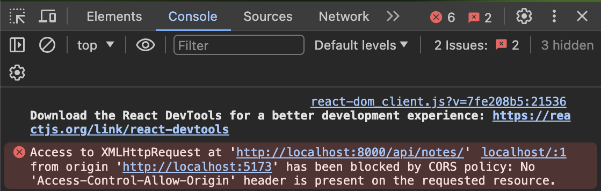
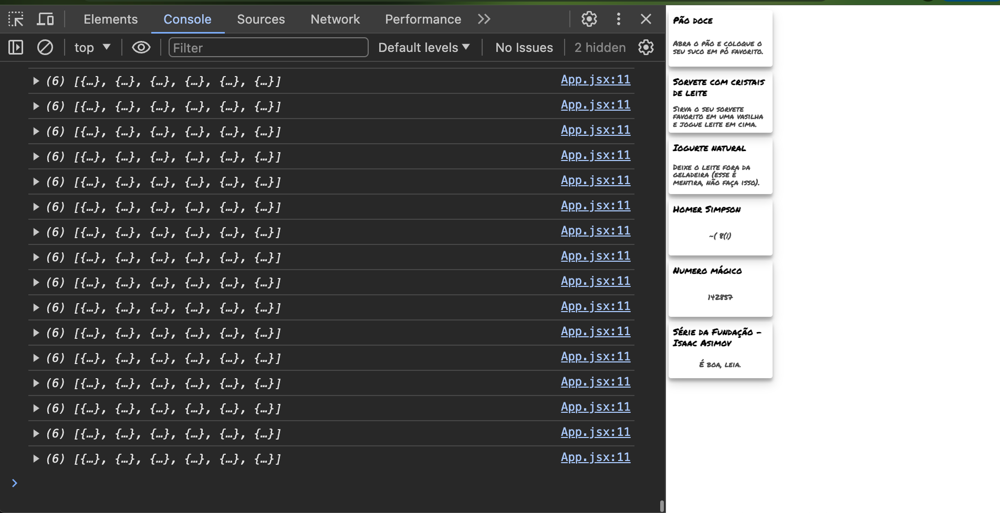

Os dados ainda estão fixos. No mundo real, os dados são dinâmicos e mudam com frequência. Para isso, precisamos de um servidor que forneça os dados. Nas aulas anteriores, aprendemos como criar APIs REST com Flask. Agora, vamos entender como conectar nossa aplicação React a um servidor REST.

Primeiro, faça o download do servidor Flask [aqui](./api.py). Execute o servidor em um terminal e deixe-o rodando. O servidor deve estar rodando na porta 8000.

Agora só precisamos implementar o cliente que se conectará com ele. Para isso, vamos utilizar o axios. Comece instalando o axios no nosso projeto. No terminal, dentro da pasta do projeto (notes-frontend), rode o comando a seguir:
```bash
    npm i axios
```
Agora modifique o seu código do `src/App.js` para utilizar o axios para realizar uma requisição GET para o servidor REST que acabamos de criar.:

```jsx hl_lines="1 19-21"
import axios from "axios";
import Note from "./components/Note";
import "./App.css";

function App() {
  const notes = [
    {
      id: 1,
      title: "Receita de miojo",
      content:
        "Bata com um martelo antes de abrir o pacote. Misture o tempero, coloque em uma vasilha e aproveite seu snack :)",
    },
    {
      id: 2,
      title: "Sorvete de banana",
      content: "Coloque a banana no congelador e espere.",
    },
  ];
  axios
    .get("http://localhost:8000/api/notes/")
    .then((res) => console.log(res));

  return (
    <>
      {notes.map((note) => (
        <Note key={`note__${note.id}`} title={note.title}>
          {note.content}
        </Note>
      ))}
    </>
  );
}

export default App;
```

!!! danger "Importante!"
    Antes de testar, lembre-se de colocar o servidor Flask para rodar.

!!! danger "Importante!"
    Ao tentar executar o código acima, um erro semelhante a esse deve aparecer no console do navegador:

    <figure markdown="span">
        { width="60%" }
        <figcaption>Erro de CORS</figcaption>
    </figure>

    Esse erro ocorre porque o navegador está tentando te proteger. Ele não fará requisições para servidores que não aceitam explicitamente requisições de outros endereços. O nosso frontend está rodando em `localhost:5173` e o backend em `localhost:8000`. Eles são endereços diferentes, então a requisição é bloqueada.

    Para esse tipo de requisição ser desbloqueada, precisamos adicionar o header CORS, indicando que [aceitamos essa requisição](https://drawings.jvns.ca/cors/){:target="_blank"}:

    **No projeto Flask,** adicione a biblioteca `flask-cors`:

    ```
    pip install django-cors-headers
    ```

    Altere o início do arquivo `app.py` para adicionar as duas linhas abaixo:

    ```python hl_lines="1 4"
from flask import Flask, jsonify, request
from flask_cors import CORS

app = Flask(__name__)
CORS(app)
    ```

    O `CORS(app)` habilita o CORS para todas as rotas do servidor. Isso significa que qualquer origem pode acessar o servidor. Isso é seguro para o nosso projeto, mas não é recomendado para produção. Para produção, você deve configurar o CORS para aceitar apenas requisições de endereços específicos (nosso projeto React, por exemplo).

Depois de realizar as adaptações no servidor, seu código deve funcionar e a requisição devolve a lista de anotações do servidor.

## Guardando os dados

O app já é capaz de fazer a requisição e receber os dados, mas ainda não mostra nada diferente na tela. Poderíamos simplesmente guardar os dados em uma variável e utilizá-la para renderizar os componentes. Pensamos em algo assim:


```jsx hl_lines="7"
import axios from "axios";
import Note from "./components/Note";
import "./App.css";

function App() {

  const notes = axios.get("http://localhost:8000/api/notes/").then((res) => setNotes(res.data));

  return (
    <>
      {notes.map((note) => (
        <Note key={`note__${note.id}`} title={note.title}>
          {note.content}
        </Note>
      ))}
    </>
  );
}

export default App;
```

!!! danger "Erro"
    O código acima não funciona. :woman_gesturing_no: Como a função `axios.get` é assíncrona, a variável `notes` não é preenchida com os dados da requisição.

O problema é que a requisição é feita em uma chamada assíncrona, assim, não sabemos **quando** o resultado será obtido. Como o componente é uma função, ele não pode armazenar estado como um objeto. Ela é executada para gerar a tela e termina a execução.

Por isso foram criados os chamados [**hooks**](https://react.dev/reference/react), que permitem o armazenamento de estado em componentes funcionais. Vamos utilizar o `#!js useState` para armazenar estado. Modifique o arquivo `src/App.jsx`:

```jsx hl_lines="2 7-11"
import axios from "axios";
import { useState } from "react";
import Note from "./components/Note";
import "./App.css";

function App() {
  const [notes, setNotes] = useState([]); // Remova o array de notes que existia na versão anterior

  axios.get("http://localhost:8000/api/notes/").then((res) => setNotes(res.data));

  console.log(notes);

  return (
    <>
      {notes.map((note) => (
        <Note key={`note__${note.id}`} title={note.title}>
          {note.content}
        </Note>
      ))}
    </>
  );
}

export default App;
```

O `useState` devolve o valor do estado atual e uma função que permite modificar o estado. Ele também recebe o valor inicial do estado, no caso um array vazio.

Ao executar o código acima, o console do navegador deve mostrar o JSON de anotações diversas vezes (recomendo que você feche a aba até implementar o resto do código). 

<figure markdown="span">
    { width="70%"}
    <figcaption>Loop infinito</figcaption>
</figure>

O que acontece é que toda vez que o estado muda, o componente é renderizado novamente, ou seja, a função é re-executada. Assim, quando a requisição é finalizada, os dados são utilizados para atualizar a variável `notes` do estado. Quando isso ocorre, o componente é renderizado novamente. Isso faz com que uma nova requisição ocorra, que por sua vez realizará outra atualização do estado, que  fará com que uma nova requisição ocorra, que por sua vez... enfim, você acabou de implementar a versão de componentes React de um loop infinito!

<figure markdown="span">
    { width="70%"}
    <figcaption>Loop infinito</figcaption>
</figure>


Queremos realizar a requisição apenas uma vez. Para isso, existe um outro **hook** chamado `useEffect`, que permite definir algumas condições para quando ele deve ser re-executado. Modifique novamente o arquivo `src/App.js`:

```jsx hl_lines="1 9-13"
import axios from "axios";
import { useEffect, useState } from "react";
import Note from "./components/Note";
import "./App.css";

function App() {
  const [notes, setNotes] = useState([]);

  useEffect(() => {
    axios
      .get("http://localhost:8000/api/notes/")
      .then((res) => setNotes(res.data));
  }, []);

  console.log(notes);

  return (
    <>
      {notes.map((note) => (
        <Note key={`note__${note.id}`} title={note.title}>
          {note.content}
        </Note>
      ))}
    </>
  );
}

export default App;
```

O primeiro argumento do `useEffect` é uma função. Essa função será executada quando o conteúdo do segundo argumento mudar. Quando utilizamos um array vazio no segundo argumento, a função é executada apenas uma vez.

## Carregando imagens e outros arquivos estáticos

Para continuar, avance para a próxima seção: 

[Carregando imagens e arquivos estáticos](parte-03-carregando-estaticos.md){ .md-button .md-button--primary }