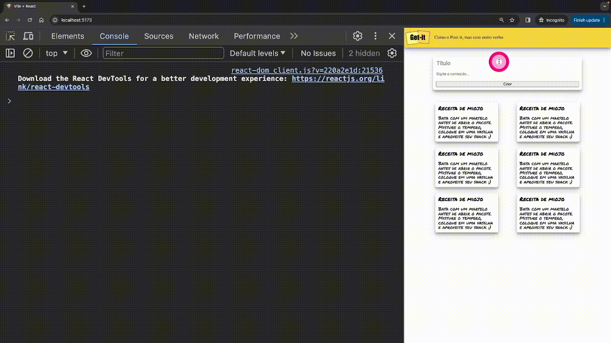

Vamos criar um componente para o formulário de criação.

1. Crie o arquivo `src/components/Formulario/index.jsx` com o seguinte conteúdo:

```jsx
import "./index.css";

export default function Formulario() {

    return (
        <form className="form-card">
            <input
                className="form-card-title"
                type="text"
                name="titulo"
                placeholder="Título"
            />
            <textarea
                className="autoresize"
                name="detalhes"
                placeholder="Digite o conteúdo..."
            ></textarea>
            <button className="btn" type="submit">Criar</button>
        </form>
    );
}
```


Crie o arquivo `src/components/Formulario/index.css` e coloque o estilo CSS abaixo:

```css
.form-card {
    max-width: 500px;
    display: flex;
    flex-direction: column;
    margin: 2rem auto;
    padding: 10px;
    box-shadow: 0 10px 20px rgb(0 0 0 / 19%), 0 6px 6px rgb(0 0 0 / 23%);
    border-radius: 5px;
}

.form-card input,
.form-card textarea {
    font-family: "Roboto", sans-serif;
    border: none;
    outline: none;
    resize: none;
}

.form-card-title {
    font-weight: bold;
    line-height: 1.2;
    margin-bottom: 1rem;
    font-size: 1.2rem;
}

.btn {
    position: relative;
    display: block;
    padding: 10px 15px;

    overflow: hidden;

    border-width: 0;
    outline: none;
    border-radius: 2px;
    box-shadow: 0 1px 4px rgba(0, 0, 0, 0.6);

    background-color: #f7d736;

    transition: background-color 0.3s;
}

.btn>* {
    position: relative;
}

.btn:before {
    content: "";

    position: absolute;
    top: 50%;
    left: 50%;

    display: block;
    width: 0;
    padding-top: 0;

    border-radius: 100%;

    background-color: rgba(236, 240, 241, 0.3);

    -webkit-transform: translate(-50%, -50%);
    -moz-transform: translate(-50%, -50%);
    -ms-transform: translate(-50%, -50%);
    -o-transform: translate(-50%, -50%);
    transform: translate(-50%, -50%);
}

.btn:active:before {
    width: 120%;
    padding-top: 120%;

    transition: width 0.2s ease-out, padding-top 0.2s ease-out;
}
```

## Adicionando componente Formulario no App

Precisamos adicionar o componente `Formulario` no `src/App.jsx`. Podemos pensar no componente como uma função javascript que retorna html. Para utilizar um componente, basta colocar o nome dele entre tags, como se fosse uma tag HTML. Veja o exemplo abaixo:

```jsx hl_lines="5 21"
import axios from "axios";
import { useEffect, useState } from "react";
import Note from "./components/Note";
import AppBar from "./components/AppBar";
import Formulario from "./components/Formulario";
import "./App.css";

function App() {
  const [notes, setNotes] = useState([]);

  useEffect(() => {
    axios
      .get("http://localhost:8000/api/notes/")
      .then((res) => setNotes(res.data));
  }, []);

  return (
    <>
      <AppBar />
      <main className="container">
        <Formulario />
        <div className="card-container">
          {notes.map((note) => (
            <Note key={`note__${note.id}`} title={note.title}>
              {note.content}
            </Note>
          ))}
        </div>
      </main>
    </>
  );
}

export default App;
```

## Armazenado valor digitado pelo usuário nos Inputs

Vamos armazenar os valores digitados pelo usuário nas variáveis `titulo` e `conteudo`. Para isso, vamos criar duas variáveis utilizando `useState` do React no arquivo `src/components/Formulario/index.jsx`.

```jsx hl_lines="1 5-6"
import { useState } from "react";
import "./index.css";

export default function Formulario() {
    const [titulo, setTitulo] = useState("");
    const [content, setContent] = useState("");
    
    return (
        <form className="form-card" method="post">
            <input
                className="form-card-title"
                type="text"
                name="titulo"
                placeholder="Título"
            />
            <textarea
                className="autoresize"
                name="detalhes"
                placeholder="Digite o conteúdo..."
            ></textarea>
            <button className="btn" type="submit">Criar</button>
        </form>
    );
}
```

As variáveis inicialmente começam como `strings` vazias `#!python ""`. Conforme o usuário digita algum valor nos campos inputs, o valor das variáveis é atualizado. Para isso podemos utilizar o atributo `onChange` do HTML, veja o exemplo abaixo:

```jsx hl_lines="15"
import { useState } from "react";
import "./index.css";

export default function Formulario() {
    const [titulo, setTitulo] = useState("");
    const [content, setContent] = useState("");

    return (
        <form className="form-card" method="post">
            <input
                className="form-card-title"
                type="text"
                name="titulo"
                placeholder="Título"
                onChange={(event) => console.log(event.target.value)}
            />
            <textarea
                className="autoresize"
                name="detalhes"
                placeholder="Digite o conteúdo..."
            ></textarea>
            <button className="btn" type="submit">Criar</button>
        </form>
    );
}
```
Sempre que o usuário interagir com o campo `input` o evento `onChange` chamará a função `(event) => console.log(event.target.value)`. O parâmetro `event` é o evento que ocorreu, e `event.target.value` é o valor digitado pelo usuário. Vamos fazer um teste para verificar se o valor digitado está sendo armazenado corretamente. Digite algo no campo `input` e veja o valor no console do navegador.

<figure markdown="span">
  
  <figcaption>Valor digitado no console</figcaption>
</figure>


Vamos alterar a função `onChange` para armazenar o valor digitado pelo usuário na variável `titulo`. Para isso, vamos utilizar a função `setTitulo` passando o valor digitado pelo usuário `event.target.value`.

```jsx hl_lines="15 21"
import { useState } from "react";
import "./index.css";

export default function Formulario() {
    const [titulo, setTitulo] = useState("");
    const [content, setContent] = useState("");

    return (
        <form className="form-card" method="post">
            <input
                className="form-card-title"
                type="text"
                name="titulo"
                placeholder="Título"
                onChange={(event) => setTitulo(event.target.value)}
            />
            <textarea
                className="autoresize"
                name="detalhes"
                placeholder="Digite o conteúdo..."
                onChange={(event) => setContent(event.target.value)}
            ></textarea>
            <button className="btn" type="submit">Criar</button>
        </form>
    );
}
```


## Enviar os dados para o servidor
Agora vamos enviar os dados para o servidor. Para isso, vamos utilizar o atributo `onSubmit` do HTML. Veja o exemplo abaixo:

O comando [event.preventDefault()](https://developer.mozilla.org/en-US/docs/Web/API/Event/preventDefault){:target="_blank"} previne que o formulário seja enviado para o servidor. Assim, podemos enviar os dados utilizando o axios.

```jsx hl_lines="1 9-20 23"
import axios from "axios";
import { useState } from "react";
import "./index.css";

export default function Formulario() {
    const [titulo, setTitulo] = useState("");
    const [content, setContent] = useState("");

    const criarNote = (event) => {
        event.preventDefault();

        const data = {
            "title": titulo,
            "content": content
        }

        axios
            .post("http://localhost:8000/api/notes/", data)
            .catch((error) => console.log(error));
    }

    return (
        <form className="form-card" onSubmit={criarNote}>
            <input
                className="form-card-title"
                type="text"
                name="titulo"
                placeholder="Título"
                onChange={(event) => setTitulo(event.target.value)}
            />
            <textarea
                className="autoresize"
                name="detalhes"
                placeholder="Digite o conteúdo..."
                onChange={(event) => setContent(event.target.value)}
            ></textarea>
            <button className="btn" type="submit">Criar</button>
        </form>
    );
}
```

Tente criar uma nova anotação! 
Parece que não está funcionando, certo? Se atualizar a página, perceberá que anotação foi criada, porém a página não foi atualizada. Vamos resolver isso!

## Atualizando a lista de anotações
Agora que já enviamos os dados para o servidor, precisamos atualizar a lista de anotações. Se olharmos o código do arquivo `src/App.jsx` queremos executar o código contido nas linhas marcadas abaixo, pois queremos atualizar a lista de anotações.

```jsx hl_lines="12-14"
import axios from "axios";
import { useEffect, useState } from "react";
import Note from "./components/Note";
import AppBar from "./components/AppBar";
import Formulario from "./components/Formulario";
import "./App.css";

function App() {
  const [notes, setNotes] = useState([]);

  useEffect(() => {
    axios
      .get("http://localhost:8000/api/notes/")
      .then((res) => setNotes(res.data));
  }, []);

  return (
    <>
      <AppBar />
      <main className="container">
        <Formulario />
        <div className="card-container">
          {notes.map((note) => (
            <Note key={`note__${note.id}`} title={note.title}>
              {note.content}
            </Note>
          ))}
        </div>
      </main>
    </>
  );
}

export default App;
```

Para isso, vamos mover esse trecho de código para dentro de uma função, para que possamos enviar essa função para o componente `Formulario`.


```jsx hl_lines="11-15 18"
import axios from "axios";
import { useEffect, useState } from "react";
import Note from "./components/Note";
import AppBar from "./components/AppBar";
import Formulario from "./components/Formulario";
import "./App.css";

function App() {
  const [notes, setNotes] = useState([]);

  const carregaNotas = () => {
    axios
      .get("http://localhost:8000/api/notes/")
      .then((res) => setNotes(res.data));
  }

  useEffect(() => {
    carregaNotas();
  }, []);

  return (
    <>
      <AppBar />
      <main className="container">
        <Formulario />
        <div className="card-container">
          {notes.map((note) => (
            <Note key={`note__${note.id}`} title={note.title}>
              {note.content}
            </Note>
          ))}
        </div>
      </main>
    </>
  );
}

export default App;
```

Vamos enviar a função `carregaNotas` para o componente `Formulario` utilizando o nome `loadNotes`. 
Lembra que os componentes são funções javascript? Em alguns casos, vamos querer passar um argumento para a função. 

Em nosso casso, estamos querendo passar a função `carregaNotas` como argumento para a função/componente `Formulario`. 

```jsx hl_lines="25"
import axios from "axios";
import { useEffect, useState } from "react";
import Note from "./components/Note";
import AppBar from "./components/AppBar";
import Formulario from "./components/Formulario";
import "./App.css";

function App() {
  const [notes, setNotes] = useState([]);

  const carregaNotas = () => {
    axios
      .get("http://localhost:8000/api/notes/")
      .then((res) => setNotes(res.data));
  }

  useEffect(() => {
    carregaNotas();
  }, []);

  return (
    <>
      <AppBar />
      <main className="container">
        <Formulario loadNotes={carregaNotas}/>
        <div className="card-container">
          {notes.map((note) => (
            <Note key={`note__${note.id}`} title={note.title}>
              {note.content}
            </Note>
          ))}
        </div>
      </main>
    </>
  );
}

export default App;
```

## Chamando a função `carregaNotas` no componente `Formulario`

O componente `Formulario` recebe o argumento `props` que contém todas as informações enviadas para o componente.
Como enviamos a função `carregaNotas` com o nome de `loadNotes`, para chamar a função `carregaNotas` dentro do componente `Formulario` utilizamos o comando `#!js props.loadNotes()`.

```jsx hl_lines="5 19"
import axios from "axios";
import { useState } from "react";
import "./index.css";

export default function Formulario(props) {
    const [titulo, setTitulo] = useState("");
    const [content, setContent] = useState("");

    const criarNote = (event) => {
        event.preventDefault();

        const data = {
            "title": titulo,
            "content": content
        }

        axios
            .post("http://localhost:8000/api/notes/", data)
            .then((response) => props.loadNotes())
            .catch((error) => console.log(error));
    }

    return (
        <form className="form-card" onSubmit={criarNote}>
            <input
                className="form-card-title"
                type="text"
                name="titulo"
                placeholder="Título"
                onChange={(event) => setTitulo(event.target.value)}
            />
            <textarea
                className="autoresize"
                name="detalhes"
                placeholder="Digite o conteúdo..."
                onChange={(event) => setContent(event.target.value)}
            ></textarea>
            <button className="btn" type="submit">Criar</button>
        </form>
    );
}
```

## Limpando os valores dos campos do Formulário

Ao criar uma nova anotação, os dados estão sendo salvos no banco de dados pela API Django REST e a página é atualizada com a nota anotação aparecendo na página. Porém, os campos do formulário não estão sendo limpos. Para limpar os campos do formulário, basta atualizar as variáveis `titulo` e `content` com o valor `#!python ""` (string vazia). Além disso, é necessário utilizar essas variáveis para definir o valor dos campos do formulário. Veja o exemplo abaixo:


```jsx hl_lines="21-22 35 42"
import axios from "axios";
import { useState } from "react";
import "./index.css";

export default function Formulario(props) {
    const [titulo, setTitulo] = useState("");
    const [content, setContent] = useState("");

    const criarNote = (event) => {
        event.preventDefault();

        const data = {
            "title": titulo,
            "content": content
        }

        axios
            .post("http://localhost:8000/api/notes/", data)
            .then((response) => {
                props.loadNotes();
                setTitulo("");
                setContent("");
            })
            .catch((error) => console.log(error));
    }

    return (
        <form className="form-card" onSubmit={criarNote}>
            <input
                className="form-card-title"
                type="text"
                name="titulo"
                placeholder="Título"
                onChange={(event) => setTitulo(event.target.value)}
                value={titulo}
            />
            <textarea
                className="autoresize"
                name="detalhes"
                placeholder="Digite o conteúdo..."
                onChange={(event) => setContent(event.target.value)}
                value={content}
            ></textarea>
            <button className="btn" type="submit">Criar</button>
        </form>
    );
}
```

!!! exercise "Deletando uma anotação"
    Implemente a funcionalidade de deletar uma anotação. Para isso, crie um botão dentro do componente `Note` que ao ser clicado, envie uma requisição para a API Django REST para deletar a anotação. Após deletar a anotação, atualize a lista de anotações.

## Implementando a Edição de Anotações

Para continuar, avance para a próxima etapa.

[Implementando a edição de Anotações](parte-05-editando-anotacao.md){ .md-button .md-button--primary }