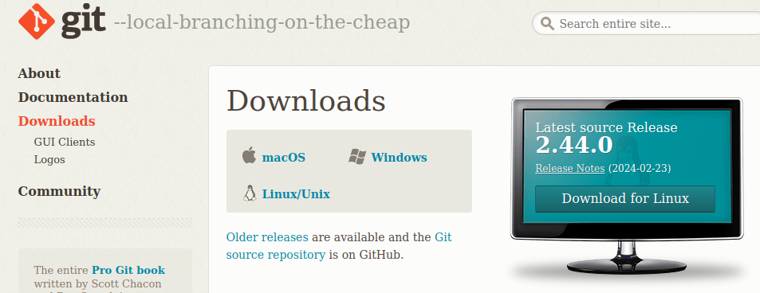

# Ferramentas Básicas: Git

Responsável: Sarti

# Git ou GitHub:

Vocês já tiveram contato com o GitHub no primeiro semestre, mas agora iremos realmente explorar o Git, uma ferramenta do cotidiano de todo desenvolvedor. E uma informação importante, Git e GitHub **NÃO** são a mesma coisa. Por conta do primeiro semestre e da superficialidade com a qual o tema é abordado, ambos podem se confundir, mas Git é a ferramenta de controle de versão, enquanto GitHub é apenas um portal de compartilhamento de repositórios Gits, pertencente à Microsoft. O mais famoso de todos, mas apenas mais um portal, tendo múltiplos outros concorrentes, como por exemplo o projeto open source GitLab.

# Como baixar o Git:

Se você por algum motivo não possui o git instalado, no site do Git ([https://git-scm.com/](https://git-scm.com/)) clique em downloads e siga os passos para seu sistema operacional. Este pode variar um pouco de um sistema para outro, mas em todos deve ser um processo simples e intuitivo, pela popularidade da ferramenta.

# Qual a função do Git e por que usá-lo?:

O Git é uma ferramenta de controle de versão, ou seja, ela serve para salvar seu código ao longo do desenvolvimento em, idealmente, toda versão estável do projeto. Isso permite que, caso algum erro ou bug venha a aparecer em seu código, a rastreabilidade do erro se torne mais fácil, além de possibilitar o retorno do código para uma versão estável, caso necessário. Outra vantagem do Git é facilitar o compartilhamento e trabalho conjunto em um código, pois podemos garantir que todos os envolvidos terão exatamente o mesmo código com as exatas mesmas alterações.

### O lado obscuro do Git:

Apesar de no papel o Git ser uma ferramenta fenomenal, maravilhosa e milagrosa, ela está mais próxima de "A melhor solução ruim para um problema" do que realmente "Uma ótima solução de um problema". Uma frase bem comum, principalmente para quem está aprendendo Git, é "Git é ruim, só não temos uma solução melhor". Isso se deve à grande complexidade de entender o Git completamente e todos os problemas que surgem quando muitas pessoas tentam mexer em um mesmo sistema ao mesmo tempo. Desde conflitos de Merge com coisas simples até Rebases de código e fetch/fast-forwards impossíveis, iremos nos atrapalhar com o Git enquanto não tivermos entendido muito bem o que está acontecendo. Para evitar esses problemas, sigam algumas regras ao trabalhar com Git:

- Nunca editar o mesmo arquivo ou função do colega, até que o mesmo dê merge.
- Commits e merges constantes, seja em algum branch Auxiliar ou na Main.
- Utilizar branches. Apesar de confuso no começo e parecer só atrapalhar, a ideia de "codar todo mundo direto no main" só é boa até 4 pessoas diferentes darem push commit ao mesmo tempo no mesmo branch com várias edições importantes no mesmo arquivo. É comum as coisas darem errado no código ou no merge, então é melhor que deem errado no seu branch pessoal do que na main do projeto inteiro.
- Nunca deixe para dar "pull main" mais tarde, caso haja uma atualização em um arquivo que você está utilizando. Faça questão de sempre manter o Main o mais atualizado possível, mesmo que isso implique em comitar um código incompleto em SEU branch apenas para dar pull e continuar seu código.

### O maior problema do Git:

Como pôde ser visto no tópico anterior, o Git pode ser bem traumático para quem está aprendendo, principalmente quando você precisa entregar um trabalho às 23:59, mas um conflito de merge desconhecido envolvendo 200 linhas de código aparece do nada às 23:20, pois alguém deu um commit na main sem avisar o grupo... Caso ainda não tenham percebido, o Git é uma ferramenta muito boa, mas tem um grande problema que pode transformar todas as suas qualidades em dores de cabeça: o trabalho em equipe e o erro humano. Sem uma boa comunicação, trabalho em equipe e constante transferências de código, problemas começam a aparecer, principalmente quando muitas pessoas trabalham ao mesmo tempo. Então lembrem-se: sempre se comuniquem e estejam com seu código atualizado.

# Merge Conflict:

Este é o erro mais comum e cansativo de corrigir que encontrarão, principalmente quando o grupo não tem uma boa comunicação. Para resolver isso, ou o branch que está causando conflito é abandonado e as mudanças são refeitas a partir do commit mais recente da branch main, ou algum membro do grupo deverá resolver o conflito de merge. Para resolver o conflito, sugiro o uso da extensão do VSCode para resolver conflitos. Ao clicar no arquivo com conflito, o VSCode irá mostrar as duas versões do código e a versão final, e você poderá escolher qual versão manter e qual deletar. Após isso, basta salvar o arquivo e dar commit.

# Comandos Git: Terminal

Apesar de ter uma interface com o VSCode, o git foi construído para ser usado via terminal. Entender como o Git funciona via terminal é fundamental pois a interface do VSCode não é tão completa quanto a do terminal e não possui todos os comandos do Git.

Os comandos mais importantes do git são: 

- `git init`: Cria uma pasta `.git` que contém aquivos responsáveis por monitorar as pastas e arquivos, iniciando um novo repositório.
- `git clone REP`: Substitua o REP pela chave do repositório, seja ela SSH ou HTTPS. Clona um repositório do GitHub ou concorrentes para sua máquina local.
- `git add ELEMENTO`: Adiciona mudanças no repositório para serem salvas (staged changes). Troque ELEMENTO pelo que deseja salvar, seja um arquivo, pasta, ou qualquer coisa que foi alterada.

    obs: Utilize “.” no lugar de elemento para adicionar todas as mudanças existentes no repositório.

- `git commit -m "MENSAGEM"`: Faz o commit **LOCAL** de todas as mudanças marcadas para commit (staged changes). Após isso o commit ficara salvo localmente e deverá ser enviado para o remote.
- `git pull/push origin BRANCH`: Os comandos fundamentais do Git, substitua BRANCH pelo branch em questão (normalmente será main). Push envia o seu último commit para o origin(remote) do branch apontado, e Pull puxa o último commit dele.
    
    obs: Remote/origin refere-se ao repositório nuvem de origem. Basicamente este é o nosso repositório do GitHub.
    

Existem muitos outros comandos Git para utilizar, mas estes vocês podem pesquisar caso necessário. Assim como o terminal, sua documentação é bem farta e extensa para resumir tudo aqui. 

# Video Introdutório de Git:

É importante que todos entendam o conceito de Git Trees e o funcionamento do Git para seu uso adequado. Os vídeos a seguir talvez tenham uma abordagem mais amigável:

### Vídeos curtos:

[https://www.youtube.com/watch?v=hwP7WQkmECE](https://www.youtube.com/watch?v=hwP7WQkmECE)

[https://www.youtube.com/watch?v=e9lnsKot_SQ](https://www.youtube.com/watch?v=e9lnsKot_SQ)

### Vídeo longo:

[https://www.youtube.com/watch?v=mJ-qvsxPHpY](https://www.youtube.com/watch?v=mJ-qvsxPHpY)