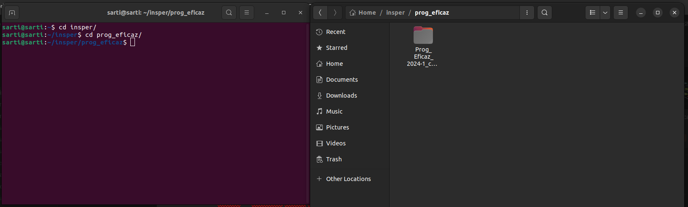

# Ferramentas Básicas: Terminal

Responsável: Sarti

# Introdução:

Ao longo do segundo semestre do curso de Programação Eficaz, iremos começar nosso contato com várias ferramentas do cotidiano de todo desenvolvedor. Uma delas, que pode parecer inútil ou até mesmo assustadora à primeira vista, é o Terminal do seu sistema operacional. Este guia serve para auxiliar no seu contato inicial com a ferramenta, além de fornecer alguns comandos e usos básicos diários do terminal.

## Instalação:

O terminal é uma ferramenta que, por padrão, já vem instalada em qualquer computador, independentemente de seu sistema operacional. Para utilizá-lo, é necessário aprender os comandos que devem ser digitados nele. Um problema é que esses comandos podem variar dependendo do sistema operacional. Os sistemas Linux e MacOS compartilham todos os comandos básicos, enquanto o Windows possui comandos diferentes. Um fato muito relevante é que hoje a enorme maioria dos servidores utilizam sistemas Linux. Isso significa que mesmo que você não use Linux no seu dia a dia, é muito importante aprender a usar seus comandos de terminal, pois eles serão muito úteis no futuro próximo.

Se você possui um computador com Windows e já está ficando preocupado em ter que aprender dois conjuntos diferentes de comandos, não se preocupe. Existem emuladores de terminal que permitem que você utilize os comandos do Linux no Windows. Um dos mais populares é o Git Bash, que é instalado junto com o Git. Com ele, você pode utilizar os comandos do Linux no Windows e não terá que se preocupar em aprender dois conjuntos de comandos.

## Por que usar o terminal:

O uso do terminal costuma ser malvisto por aqueles que são obrigados a aprender, afinal, por que usar o terminal se temos interfaces visuais? Por que usar 5 linhas de código para criar um arquivo se posso clicar com o botão direito e selecionar “Novo arquivo”?

Bom, este modo de pensar vem, de maneira geral, de um desconhecimento do funcionamento do terminal. As coisas não são tão complicadas quanto parecem a primeira vista. Pelo contrário, após se habituar com o terminal, conseguimos gerenciar arquivos e projetos com uma velocidade muito maior, além de termos muito mais controle sobre nossos arquivos e comandos.

Além disso, o terminal é uma ferramenta muito poderosa que nos permite executar muitos comandos que não possuem interface visual, como a execução de comandos Python, Git, Curl e muito mais.

### O terminal requer PACIÊNCIA!

Não se preocupe se achar ele confuso ou contraintuitivo no começo. Ele vai te acompanhar na sua jornada por muitos anos, e se tornar proficiente no uso do terminal virá com o tempo. No começo, vamos perder um pouco de tempo tentando usá-lo agora, para ganhar tempo no futuro.

## Comandos Basicos do Terminal:

O número de comandos nativos do terminal é imenso, e se incluirmos pacotes com mais comandos (como npm), esse número se torna quase infinito. Então, por enquanto, vamos focar em aprender os comandos mais básicos do terminal e de uso cotidiano, e conforme necessário vamos pesquisando e usando novos comandos.

- `cd nome_da_pasta`: O comando “cd” é provavelmente o comando mais utilizado no terminal. Vindo do termo “Change Directory”, sua função é justamente a de mudar o diretório (pasta) na sua máquina, o que vamos utilizar para entrar e sair de pastas e arquivos.
    
    Dica: Nas primeiras aulas, abram o gerenciador de arquivos de sua máquina junto com o terminal e naveguem em paralelo nos dois. Assim, podemos ligar uma interface visual ao nosso terminal, o que pode ajudar a entender o início conturbado.
    
    
    
- `ls`: Vem de “list”. Serve para listar todas as pastas e arquivos em um diretório(pasta) da sua máquina, especificamente da pasta onde o seu terminal estiver localizado, que podemos ver no texto ao lado do cursor no terminal.
    
    
    
- `clear`: Simplesmente limpa o terminal, que pode ficar cheio de texto facilmente.
- `touch X`: Cria um arquivo vazio com o nome e extensão de X, por exemplo `touch example.py` iria criar um arquivo vazio chamado `example.py`.
- `mkdir X`: Cria um diretório(pasta) com o nome de X
- Tab: Este não é um comando, mas sim um atalho, pressionar tab 1 vez preenche o texto que você está escrevendo, e caso haja mais de 1 possibilidade, pressionar 2 vezes lista todas as possibilidades, como o comando ls faz.
- `.` e `..`: Novamente não são comandos, mas sim caminhos. Quando mexemos em diretórios do terminal, utilizamos `.` ou “source” para indicar “o diretório ATUAL”, ou seja, onde nosso terminal se encontra. E “..” refere-se ao diretório superior ou pai do atual, ou seja, “voltar um para trás”.
- Admin/Sudo: Alguns comandos podem necessitar permissões de administrador para serem executados. Em caso de Windows, basta iniciar o terminal como administrador, para quem usa Mac e Linux é necessário utilizar o comando Sudo como prefixo do comando que requer administração.

### Um pequeno exercicio:

Para praticar um pouco, segue um exercício bem simples, apenas para testar os comandos. 

Abra o seu terminal e seu gerenciador de arquivos, e deixe eles na mesma pasta (por exemplo, eu deixarei na pasta “Home”, que no meu computador é o diretório padrão de ambos).

Daqui, utilizando apenas o terminal, crie uma pasta e navegue para ela. Dentro desta pasta crie outra pasta e dentro desta crie um arquivo, após isso volte ao estado inicial do terminal. Depois reproduza os passos no seu navegador de arquivos, para assimilar o que é feito visualmente e o que é feito pelo terminal. 

## Materiais externos:

Seguem alguns materiais externos para ajudar no primeiro contato com o terminal. Para aqueles que preferirem, temos conteúdos em vídeo e uma documentação dos comandos terminal. 

Video longo contendo um resumão de comandos:

obs: Neste video varios comandos não essenciais inicialmente são abordados

<iframe width="560" height="315" src="https://www.youtube.com/embed/JEhVB4VHsTI?si=6CB8nBO8AgFNzZV-" title="YouTube video player" frameborder="0" allow="accelerometer; autoplay; clipboard-write; encrypted-media; gyroscope; picture-in-picture; web-share" referrerpolicy="strict-origin-when-cross-origin" allowfullscreen></iframe>
<!-- 
[https://www.youtube.com/watch?v=JEhVB4VHsTI](https://www.youtube.com/watch?v=JEhVB4VHsTI) -->

Playlist com videos sobre cada comando:

[https://www.youtube.com/playlist?list=PLS1QulWo1RIb9WVQGJ_vh-RQusbZgO_As](https://www.youtube.com/playlist?list=PLS1QulWo1RIb9WVQGJ_vh-RQusbZgO_As)

Introdução do Ubuntu:

[https://ubuntu.com/tutorials/command-line-for-beginners#1-overview](https://ubuntu.com/tutorials/command-line-for-beginners#1-overview)

Cheat Sheet:

[https://cheatography.com/davechild/cheat-sheets/linux-command-line/](https://cheatography.com/davechild/cheat-sheets/linux-command-line/)