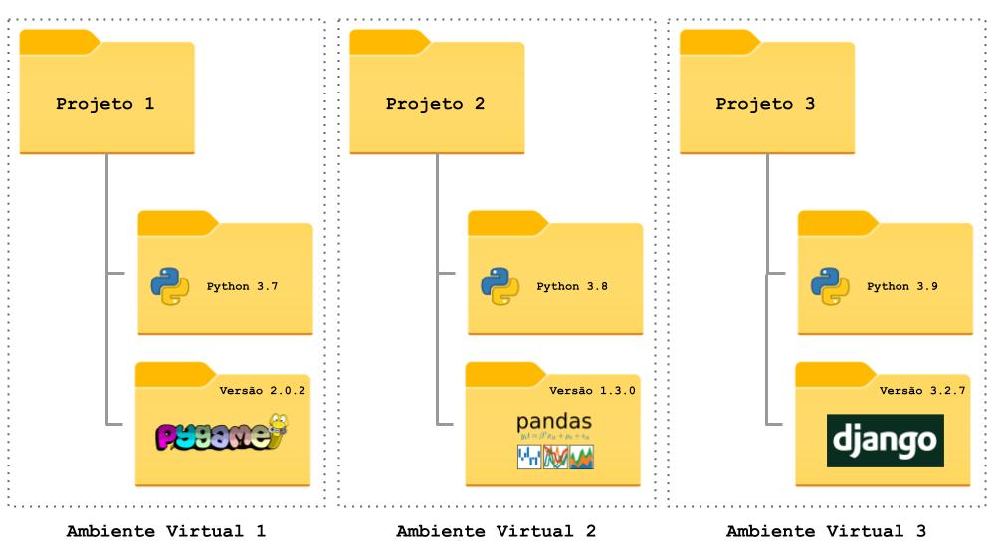
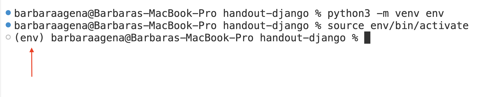

# Ambientes virtuais em Python (`venv`)

O gerenciamento de configuração é uma prática essencial para desenvolvedores, que consiste em identificar, organizar e controlar as mudanças nos componentes de um projeto ao longo do tempo. Isso garante que todas as partes do sistema estejam alinhadas, reduzindo problemas de incompatibilidade e facilitando a manutenção. No contexto do desenvolvimento em Python, isso inclui definir a versão do Python utilizada, os pacotes instalados e suas respectivas versões.



Considere o seguinte cenário: quando você começou a usar Python, a versão mais recente talvez fosse o Python 3.11 ou 3.12. Atualmente, estamos no Python 3.13, e o lançamento do Python 3.14 já está programado. Qual o problema disso? Do ponto de vista do avanço da tecnologia isso parece ótimo! Mas pense nos seus projetos antigos. O que acontecerá com eles quando você atualizar a versão do Python no seu computador para uma versão mais recente que muda um comportamento ou remove uma função que você utilizava no projeto?

<figure>
  
</figure>

O exemplo da versão do Python é um pouco mais drástico, mas e quanto às inúmeras bibliotecas/pacotes que você utiliza em cada projeto? Durante a graduação, os projetos são, na grande maioria, abandonados assim que você acaba o semestre. No mercado de trabalho você não poderá se dar a esse luxo: projetos antigos são em geral mantidos por bastante tempo.

Para resolver esse (e outros) problema, foram criados os ambientes virtuais (`venv`) do Python. Ele cria uma "nova instalação" do Python exclusiva para o seu projeto e os pacotes são instalados apenas nesse ambiente. Ou seja, quando você muda de projeto, basta mudar de ambiente virtual para usar uma instalação diferente, com um conjunto diferente de pacotes.

!!! info "Outras linguagens de programação"
    Todas as grandes linguagens de programação atuais possuem algum tipo de ferramenta desse tipo (algumas melhores, algumas piores). Por exemplo, o NodeJS, que utilizaremos em um futuro próximo, não apenas faz o controle dos pacotes específicos de cada projeto, mas também avisa o desenvolvedor quando existe uma versão mais recente desses pacotes e sugere a atualização.

## Criando um ambiente virtual


Para criar um ambiente virtual (`venv`), utilizaremos um comando similar a este:

=== "Windows :material-microsoft-windows:/Linux :simple-linux:"
    ```bash
    python -m venv NOME_DA_PASTA_DO_VENV
    ```
=== "MacOS :material-apple:"
    ```bash
    python3 -m venv NOME_DA_PASTA_DO_VENV
    ```
    
É comum utilizarmos nomes como `env` ou `.env` para o `NOME_DA_PASTA_DO_VENV`. Para Programação Eficaz, vamos padronizar o uso do nome `env`. Assim, o comando que vamos utilizar é:

=== "Windows :material-microsoft-windows:/Linux :simple-linux:"
    ```bash
    python -m venv env
    ```
=== "MacOS :material-apple:"
    ```bash
    python3 -m venv env
    ```


Esse comando vai criar uma pasta chamada `env` dentro da pasta onde ele foi executado. Todos os arquivos necessários estarão dentro da pasta `env`.

<figure>
  
</figure>

!!! info "Apagando um `venv`"
    Se você não precisar mais do seu ambiente virtual (ou tiver criado no lugar errado), basta apagar a pasta `env`.

## Ativando um ambiente virtual

<figure>
  
</figure>


Será necessário ativar o ambiente virtual **toda vez que você for trabalhar com ele**. No começo isso pode parecer um pouco maçante, mas é apenas um comando e você logo vai se acostumar:

=== "Windows PowerShell"

        env\Scripts\Activate.ps1

=== "Windows Prompt de Comando"

        env\Scripts\activate.bat

=== "Linux/MacOS"

        source env/bin/activate

!!! danger "Importante"
    Se você utilizar um nome diferente de `env` para o seu ambiente virtual, lembre-se de substituí-lo no comando acima. Por exemplo: se o seu ambiente virtual se chama `meu-ambiente`, o comando será `source meu-ambiente/bin/activate` (ou `meu-ambiente\Scripts\activate.bat`, no Windows).

Pronto! Agora quando você utilizar o Python **nesse terminal**, será utilizada a versão do ambiente virtual.

!!! tip "Importante"
    Para saber se o ambiente virtual foi ativado com sucesso, basta verificar se no terminal aparece o nome do ambiente virtual no começo da linha.

    <figure markdown="span">
        
        <figcaption>Ambiente Virtual ativo</figcaption>
    </figure>

!!! danger "Importante"
    Os comandos acima ativam o ambiente virtual **para aquela instância do terminal**. Ou seja, se você abrir outro terminal, mesmo que seja na mesma pasta, você estará utilizando o Python do sistema.
