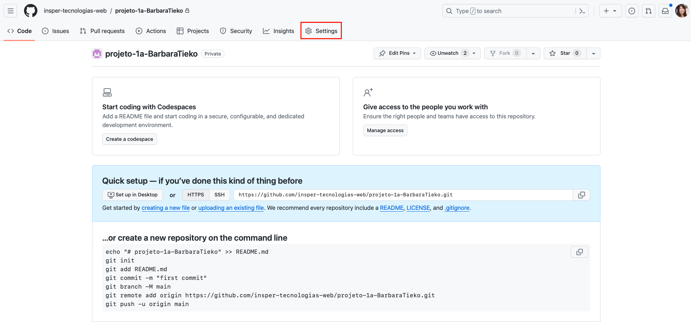
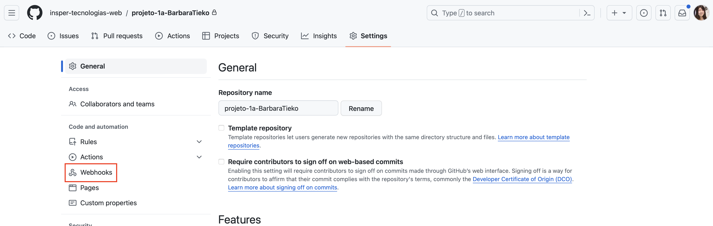
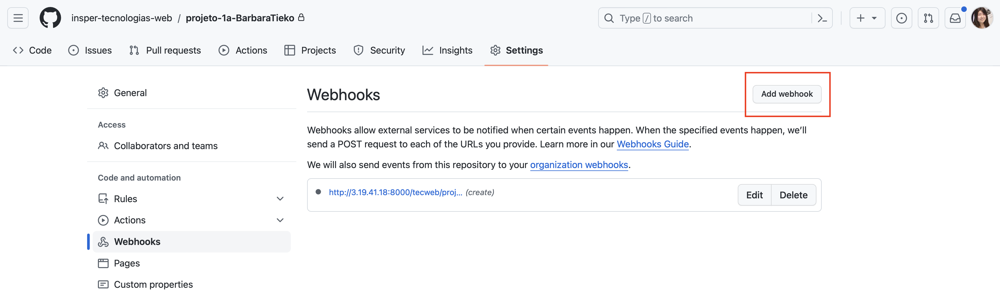
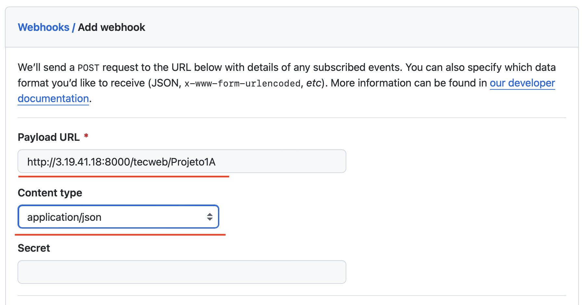
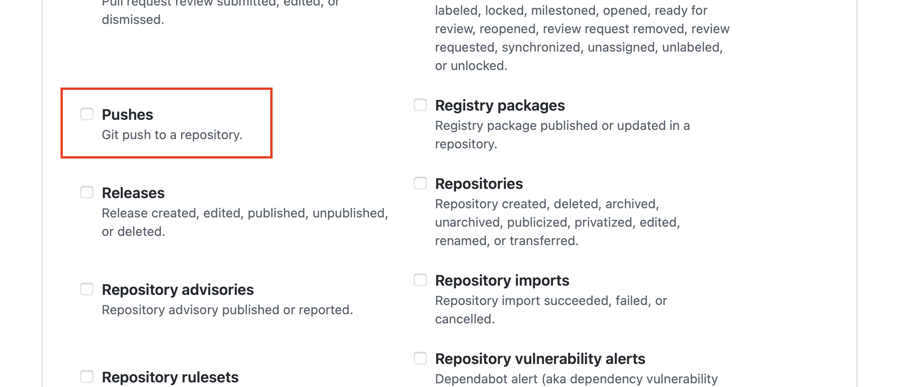
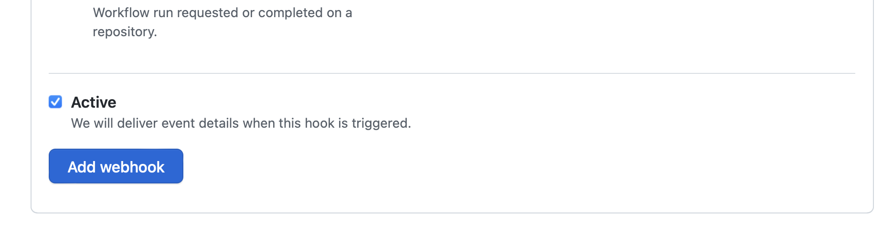

# Configurações Iniciais

## Configuração do WebHook

1. Acesse a página do repositório do projeto no GitHub e clique na aba `Settings`/`Configurações`.

    <figure markdown="span">
        { width="100%" }
        <figcaption>Configurações do repositório</figcaption>
    </figure>

2. No menu lateral, clique em `Webhooks`
    
    <figure markdown="span">
        { width="100%" }
        <figcaption>Menu Webhooks</figcaption>
    </figure>

3. Clique no botão `Add webhook`/`Adicionar webhook`.
    
    <figure markdown="span">
        { width="100%" }
        <figcaption>Adicionar Webhook</figcaption>
    </figure>

4. Preencha os campos conforme a seguir:

    - Payload URL: 
        ``` 
        http://3.19.41.18:8000/tecweb/Projeto1A
        ```
    - Content type: `application/json`

    <figure markdown="span">
        { width="100%" }
        <figcaption>URL do payload</figcaption>
    </figure>

    - Which events would you like to trigger this webhook?: `Let me select individual events`
        - Deixe {==**APENAS**==} a opção `Branch or tag creation` selecionada.

        <figure markdown="span">
            { width="100%" }
            <figcaption>Opções Selecionadas</figcaption>
        </figure>

        - {==**DESMARQUE**==} a opção `Pushes` caso esteja selecionada.
        
        <figure markdown="span">
            { width="100%" }
        </figure>

    - E por fim, deixe a opção `Active` selecionada e clique no botão `Add webhook`/`Adicionar webhook`.
        <figure markdown="span">
            { width="100%" }
        </figure>

    
5. Clone o seu repositório do Github.
    
    Crie um arquivo `README.md` e adicione o conteúdo abaixo:

    ```html title="Conteúdo do README.md"
    ## Status da Entrega
    
    ```

    <figure markdown="span">
        { width="50%" }
        <figcaption>Nome do Repositório</figcaption>
    </figure>

    O valor do atributo `src` deve ser alterado com o nome do seu repositório.

    <div class="mdx-iconsearch" data-mdx-component="iconsearch">
        <input
            class="md-input md-input--stretch mdx-iconsearch__input"
            placeholder="Digite o nome do seu repositório Github"
            data-mdx-component="iconsearch-query"
            id="repo-name"
        />
        <div id="display-src">
        </div>
    </div>

6. Faça o commit e o push do arquivo `README.md` para o repositório do Github.

[Organizando o Repositório](organizacao-repositorio.md){ .md-button }

    

    