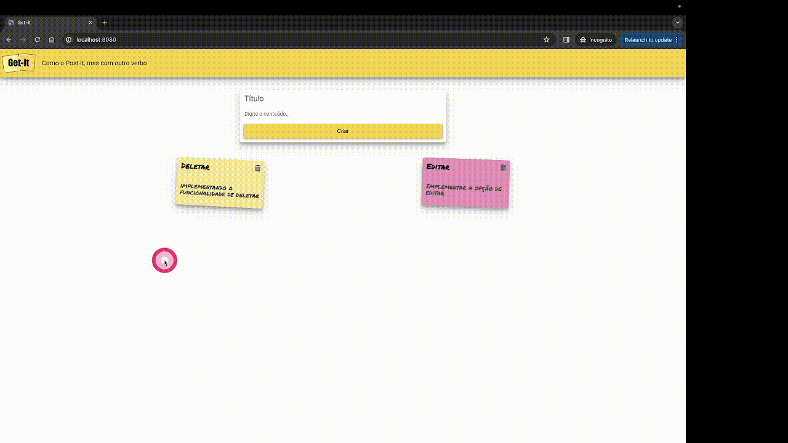
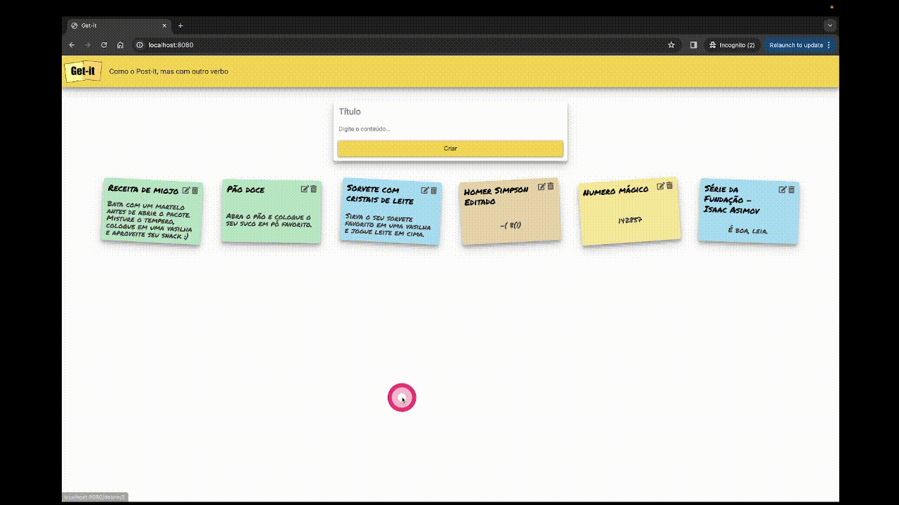

# Tarefas do Projeto 1A

No handout 01 várias trechos de código pronto foram apresentados e explicações foram dadas sobre como cada trecho funciona. Neste projeto será necessário que vocês implementes funcionalidades novas ao código base para verificarem que compreenderam o funcionamento do código.

Para este projeto, vocês devem implementar as 4 funcionalidades a seguir:


## **1. Estilo da página** :dress:

- O estilo css já foi implementado na atividade **Desafio CSS**, agora é necessário adicionar este estilo no código do *handout 01*.

Para isso, será necessário:

- Adicionar os arquivos `getit.css` e `getit.js` do Desafio CSS na pasta do repositório do projeto.

- Fazer um merge manual dos arquivos `index.html` e `notes.html` do Desafio CSS + Handout 01. Esta etapa deve ser realizada com cuidado pois existem trechos de uma versão que não existem na outra.
    - Leia o arquivo `index.html` do Handout 01 e avalie quais trechos devem ser mantidos;
    - Leia o arquivo `index.html` do Desafio CSS e procure por possíveis comentários e avalie se algo deve ser alterado;
    - Leia o arquivo `index.html` do Desafio CSS e avalie qual trecho de código não é necessário;
    - Leia o arquivo `notes.html` do Handout 01 e avalie quais trechos devem ser mantidos.      
        - Avalie o que deveria ser adicionado.
        - Qual trecho de HTML representa uma nota? :thinking:

Realize alguns testes para inserir novas notas para verificar se as funcionalidades do Handout 01 continuam funcionando.

Ao finalizar esta etapa, a página deve estar com o estilo do Desafio CSS e com as funcionalidades do Handout 01.

## **2. Persistência de dados** :material-dice-6:

Nesta etapa, você deverá implementar a persistência dos dados com SQLite utilizando o resultado obtido no Handout 03.

- Utilize o arquivo `database.py` desenvolvido no handout de persistência de dados. 

**Dica** :material-alarm-light:

- Nesta etapa, as alterações podem ser feitas no arquivo `utils.py`. Procure todos os trechos de código que realizam leitura e escrita do arquivo `notes.json` e altere para que estas operações sejam realizadas no banco de dados.
    - **Dica** Faça as alterações aos poucos e testes. Evite fazer muitas alterações de uma vez só. Por exemplo, altere a função que lê o arquivo `notes.json` para que ela leia do banco de dados e verifique se a aplicação continua funcionando. Muito provavelmente, você perceberá que esqueceu de alterar alguma coisa e terá que consertar o código.

    Somente prossiga para a próxima alteração quando tiver certeza que a alteração anterior está funcionando corretamente.

- Os códigos do arquivo `exemplo_de_uso.py` são um bom exemplo de como você deverá utilizar a classe `Database` para realizar as operações de CRUD (Create, Read, Update and Delete ).

- Ao finalizar esta etapa, caso não utilize mais o arquivo `notes.json`, apague o arquivo do repositório.


## **3. Apagar anotações** :material-delete:

Permitir que o usuário apague uma anotação;

- Adicione um botão/link no `card` de cada nota existente para excluir esta nota.
- Um botão/link geram uma requisição quando o usuário clica nele. Quando adicinar um botão/link faça um teste para ver a requisicão que é gerada.
- **Dica:** Trabalhar com link (elemento html <a\>) pode ser mais fácil do que trabalhar com botões (elemento html <\button>). Pesquise sobre a tag `#!html <a>`.
- Você pode utilizar o método **GET** ou **POST** para esta tarefa.
    - **GET:** Caso opte pelo método **GET** a requisição deve seguir o seguinte formato:
        ```
        GET /delete/<NOTA_ID> HTTP/1.1
        ```
        (Obs.: A rota pode variar um pouco dependendo da forma como você escolher implementar)
    - **POST:** Caso opte pelo método **POST** a requisição deve seguir o seguinte formato:
        ```
        POST /delete HTTP/1.1
        <HTTP_HEADERS>

        id=<NOTA_ID>
        ```
        Para enviar o id no formulário, pesquise por `#!html <input type="hidden" />`
- **Observação:** Note que o `id` da nota não deve aparecer na tela, pois esta informação é irrelevante para o usuário.

### Exemplo
<figure markdown="span">
    { width="100%" }
    <figcaption>Exemplo da funcionalidade de deletar</figcaption>
</figure>


## **4. Editar anotações** :material-file-edit:
Permitir a edição de anotações existentes;

- Adicione um botão/link na nota para a função de editar. Ao clicar no botão de edição, o usuário deve ser direcionado para uma página html nova de edição.
    - Ao clicar no botão/link, o servidor deverá receber uma requisição no seguinte formato:
        ```
        GET /update/<NOTA_ID> HTTP/1.1
        ```
- A página de edição deve apresentar um formulário com o `título` e `conteúdo` já preenchidos.
- Você precisará de um método novo no arquivo `database.py` que recebe como argumento o `id` de uma anotação e retorna esta anotação no formato de um objeto do tipo `Note`. 
- Esta página deve apresentar dois botões: `Salvar` e `Cancelar`. Caso os nomes sejam diferentes o teste de editar anotações não passará com sucesso.
    - Ao clicar no botão/link de `Cancelar` o usuário deve ser direcionado para a página principal.
        - O botão/link deverá ter o texto `Cancelar`
        - O botão/link deverá ter a propriedade `name` igual `edit_cancel`
    - Ao clicar no botão de `Salvar` a aplicação deve receber uma requisição no seguinte formato:
        ```
        POST /update HTTP/1.1
        <HTTP_HEADERS>

        id=<NOTA_ID>&titulo=<NOTA_TITULO>&detalhes=<NOTA_DETALHES>
        ```
    As alterações devem ser registradas no banco de dados e em seguida o usuário deve ser direcionado para a página inicial.

### Exemplo
<figure markdown="span">
    { width="100%" }
    <figcaption>Exemplo da funcionalidade de editar</figcaption>
</figure>


## Conceito A+

Para o conceito A+, converse com a professora e combine qual funcionalidade será entregue para atingir este conceito. Essa funcionalidade deve ser validada com a professora. Funcionalidades não validadas não serão consideradas para o conceito A+.

Além disso, a funcionalidade extra será considerada somente se o projeto atingir o conceito A.