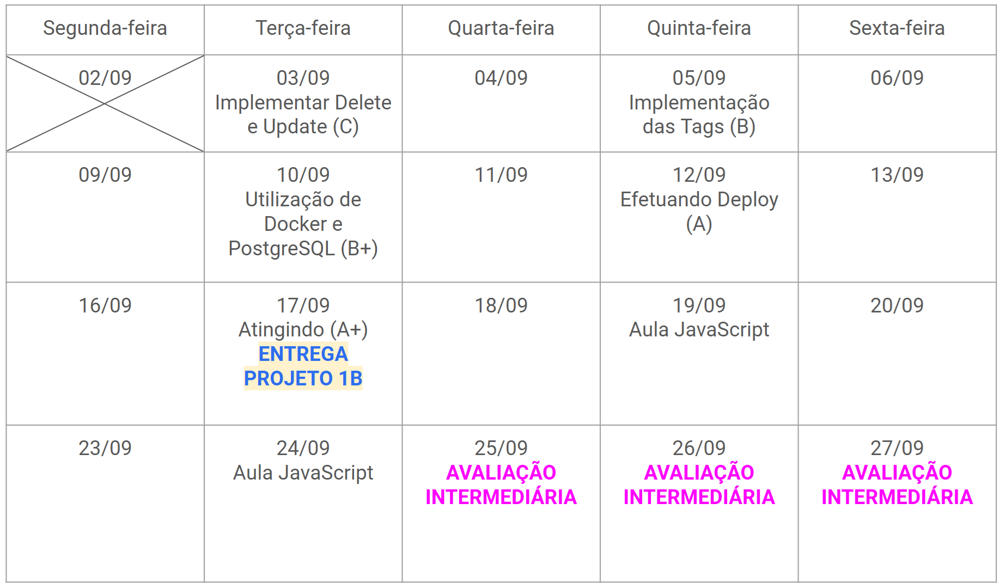

# Projeto 1: Parte B

!!! success "Entrega"
    :date: 17/09 (terça-feira)
    
    :clock1: Commits até as 23:59

    :material-account-group: Individual

    :simple-github: Entrega via [ :point_right: GitHub Classroom](https://classroom.github.com/a/q1MxyDlK){: target="_blank"}.

Caso não tenha criado o repositório, acesse o link [Github classroom](https://classroom.github.com/a/q1MxyDlK){:target="_blank"} para criar o repositório para este projeto.

Na [parte A](projeto1a.md) você implementou o servidor em Python sem a ajuda de nenhum framework. Nesta segunda parte, o objetivo é reimplementar as funcionalidades da parte A utilizando o Django. Além disso, vamos expandir as funcionalidades do sistema, utilizar um banco de dados mais robusto do que o SQLite e finalmente publicar o nosso sistema. Dependendo de quando você estiver lendo este enunciado, você ainda não saberá como fazer todas essas coisas, mas nós teremos alguns handouts para te auxiliar nesse processo.

## Rubrica

As tarefas a serem realizadas são:

1. Reimplementar o CRUD da parte A em Django, ou seja, implementar as funcionalidades de criação, listagem, edição e remoção de anotações aplicando o mesmo estilo (css); [Para mais detalhes acesse aqui :link:](projeto1b/tarefa01.md)
2. Implementar o sistema de tags para as anotações; [Para mais detalhes acesse aqui :link:](projeto1b/tarefa02.md)
3. Utilizar o PostgreSQL (em um container Docker) ao invés do SQLite;
4. Publicar a página. Ao realizar o deploy do seu projeto 1B, adicione o link para acessar a aplicação no README.md do seu repositório.

A rubrica a seguir será utilizada na correção do Projeto 1B:

| Conceito | Descrição |
| :------: | :-------- |
|    I     | Não entregou ou o código não executa |
|    D     | O código funciona, mas a tarefa 1 não está completa |
|    C     | Tarefa 1 completa |
|    C+    | Tarefas 1 e tarefa 2 parcial|
|    B     | Tarefas 1 e 2 completas |
|    B+    | Tarefas 1, 2 e 3 completas |
|    A     | Tarefas 1, 2, 3 e 4 completas |
|    A+    | Tarefas 1, 2, 3 e 4 completas e implementou o sistema de tags Many-to-many [acesse aqui :link:](projeto1b/tags-many-to-many.md)|

## Sugestão de Cronograma

Segue abaixo uma **sugestão** de cronograma para auxialiar o desenvolvimento do Projeto 1B. 

**Obs.:** Esse cronograma foi pensado para os alunos que vão implementar o sistema até o conceito A+.

<figure markdown="span">
    { width="80%" }
    <figcaption>Calendário com o cronograma</figcaption>
</figure>

## Cronograma

- [ ] **03/09 (terça-feira)**
    - [ ] Implementar a funcionalidade de deletar uma anotação.
    - [ ] Implementar a funcionalidade de atualizar uma anotação.
    - [ ] Adicionar estilo CSS ao projeto.
    - [ ] Atingiu o **Conceito C**
- [ ] **05/09 (quinta-feira)**
    - [ ] Implementar o sistema de tags
    - [ ] Atingiu o **Conceito B**
- [ ] **10/09 (terça-feira)**
    - [ ] Utilizar o banco de dados relacionas PostgreSQL
    - [ ] Atingiu o **Conceito B+**
- [ ] **12/09 (quinta-feira)**
    - [ ] Realizar o Deploy do Projeto
    - [ ] Atingiu o **Conceito A**
- [ ] **17/09 (terça-feira)**
    - [ ] Aula Studio para finalizar o projeto
    - [ ] Efetuar a entrega
    - [ ] Atingiu o **Conceito A+**
