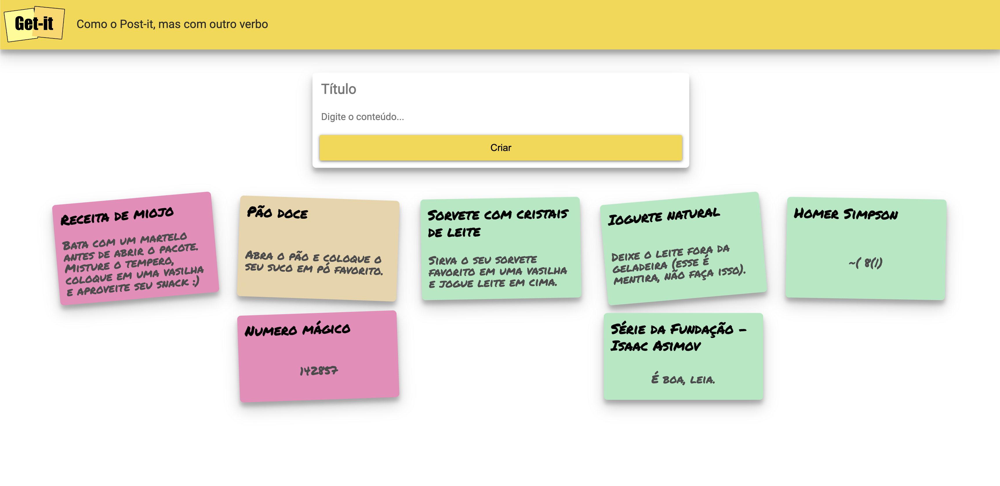
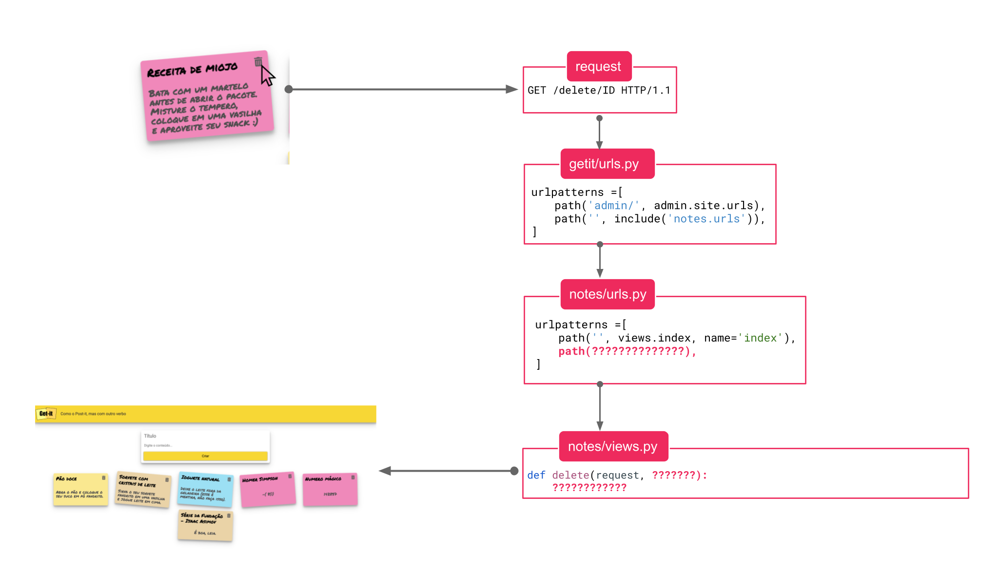
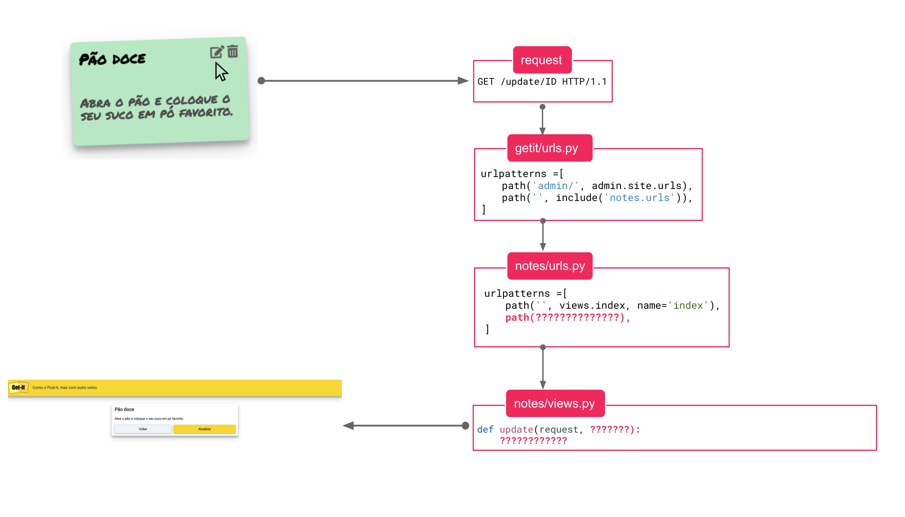
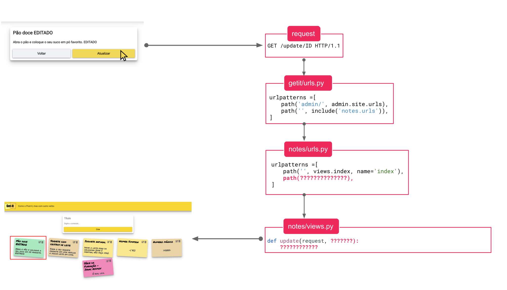
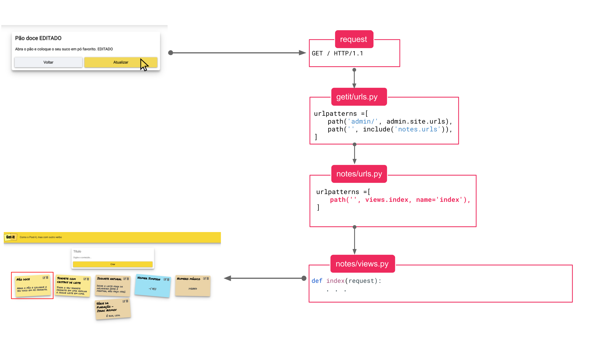

# Reimplementando Projeto 1A usando Django

Reimplementar o CRUD da parte A em Django, ou seja, implementar as funcionalidades de criação, listagem, edição e remoção de anotações.

Para esta etapa o ideal é utilizar a estrutura que o framework dispõe.
Como discutido na aula anterior, utilize mais de uma rota para mapear as diferentes requisições que o cliente pode enviar ao servidor.

## Finalizando Handout Django

Ao finalizar o handout de Django é esperado que você tenha o seguinte resultado.

<figure markdown="span">
    { width="80%" }
    <figcaption>Handout Django Concluído</figcaption>
</figure>

## Deletando uma anotação

Implemente a funcionalidade de deletar uma anotação.

<figure markdown="span">
    { width="80%" }
    <figcaption>Fluxo para implementar funcionalidade</figcaption>
</figure>

- Para implementar a funcionalidade de deletar, será necessário entender como definir uma nova rota no arquivo `urls.py`. Acesse o link a seguir e tente descobrir como você deverá realizar esta tareha [https://docs.djangoproject.com/en/5.0/topics/http/urls/#example](https://docs.djangoproject.com/en/5.0/topics/http/urls/#example){:target="_blank"}
- Talvez você precise de algo deste link [https://docs.djangoproject.com/en/5.0/topics/db/queries/#retrieving-a-single-object-with-get](https://docs.djangoproject.com/en/5.0/topics/db/queries/#retrieving-a-single-object-with-get){:target="_blank"}

## Editando uma anotação

Para a edição de anotação o fluxo é bem similar ao realizado para a página inicial. Tente se basear na função `views.index` e pense o que deve ser modificado.

Para essa funcionalidade temos as seguintes possibilidades:

### Acessando página de edição

- Usuário clica no botão de editar e é levado para a página de edição da nota;
<figure markdown="span">
    { width="100%" }
    <figcaption>Fluxo para implementar funcionalidade</figcaption>
</figure>

### Atualizando anotação

- Usuário digite um novo valor para título/conteúdo e clica no botão de `Salvar`.
- Após os dados serem atualizado no banco de dados o usuário é redirecionado para a página principal.
<figure markdown="span">
    { width="100%" }
    <figcaption>Fluxo para implementar funcionalidade</figcaption>
</figure>

### Opção de cancelar

- Usuário clica no botão de cancelar e nenhum alteração é realizada;
- Veja que mesmo que o usuário digitar algo e clicar em cancelar a nota não pode ser alterada.
- Note que ao clicar em cancelar, a requisição será `GET / HTTP/1.1`
<figure markdown="span">
    { width="100%" }
    <figcaption>Fluxo para implementar funcionalidade</figcaption>
</figure>

## Próxima etapa

Agora que implementou as funcionalidades acima, você pode prosseguir para a próxima etapa.

[Próxima Etapa](tarefa02.md){ .md-button }