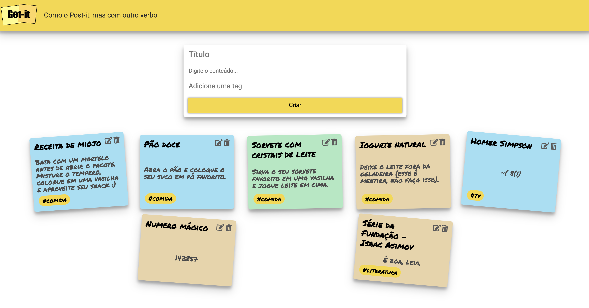
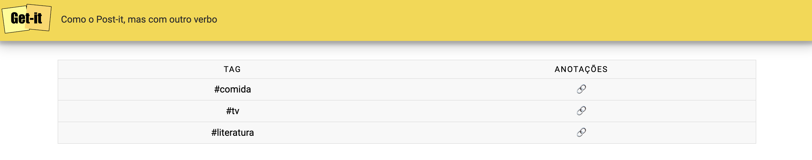
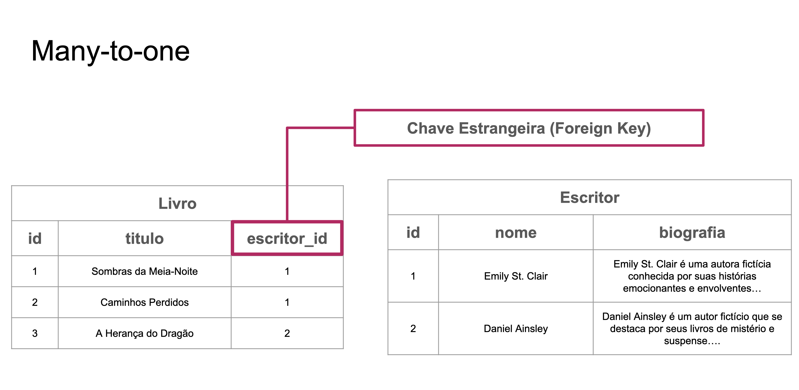

# Implementando Sistema de Tags

Na parte B você deve implementar um sistema de tags para as anotações. Cada anotação pode ter no máximo uma tag (pode não ter nenhuma).

No formulário de criação/edição de anotações deve haver um campo de texto adicional para o usuário digitar o nome da tag. 


<figure markdown="span">
    { width="100%" }
    <figcaption>Implementação de Tags</figcaption>
</figure>


Você também precisa criar mais duas páginas: uma com a lista com todas as tags existentes e outra com as anotações de uma determinada tag. 

- A lista das tags deve mostrar apenas os nomes das tags com um link para a sua respectiva página de detalhes. 
    - Para acessar esta página, implemente a rota `http://localhost:8000/tags/`;
    - Adicione um botão/link na página inicial para acessar a lista de tags.

<figure markdown="span">
    { width="80%" }
    <figcaption>Lista de todas tags</figcaption>
</figure>

- A página de detalhes de uma tag deve mostrar todas as anotações com aquela tag específica.
    - Para acessar esta página, implemente a rota `http://localhost:8000/tags/<tag_id>/`;

Ao clicar na tag `comida` na listagem de tags, o usuário é levado a outra tela onde todas as anotações que possuem a tag `comida` são mostradas.

<figure markdown="span">
    { width="80%" }
    <figcaption>Anotações de uma tag específica</figcaption>
</figure>

## Observações

- Na tela de listagem de anotações por `tag`, não é necessário fornecer as opções de deletar ou editar. Basta mostar as anotações.
- Caso não utilize a **relação Many-to-one** descrita abaixo para a implementação desta etapa, a solução não será considerada válida.
- Não devem existir tags duplicadas no banco de dados.
- O usuário pode criar anotações sem tags. 

# Relação Many-to-One

Para implementar o sistema de tags para as anotações será necessário utilizar a relação de Um para muitos do banco de dados.

Atualmente, o projeto possui apenas uma tabela para armazenar as informações das anotações.

<figure style="width:60%;">
  
</figure>

Agora, precisamos armazenar no banco de dados as informações referentes a Tags. Poderíamos simplemeste criar uma nova coluna a tabela chamada `Tag`. Porém, como estamos utilizando banco de dados relacionais e queremos utilizar os recursos que este tipo de banco de dados nos oferece. Queremos criar uma tabela nova para armazenar as informações da `Tag`.

!!! tip "Não se preocupe"
    Caso tudo isso pareça muito complicado. Não se preocupe. Vocês se aprofundarão no conteúdo de Banco de Dados Relacionais na Disciplina de Mega Dados.

Ao criar uma tabela nova para armazenar as informações de tags, nosso banco de dados ficará da seguinte forma:

<figure>
  
</figure>

A tabela `Note` ganha uma coluna nova para armazenar o `id` da `Tag`. Essa coluna chamamos de Chave Estrangeira (Foreign Key), pois a coluna armazena o `id` originário de outra tabela do banco de dados.

<figure>
  
</figure>


- No backend (no `view.py`), se essa tag já existir, você deve associar a anotação a ela, senão, crie uma nova tag no banco de dados e associe à anotação.

!!! tip "Outro Exemplo"
    A documentação oficial do Django apresenta um exemplo que pode ser acessa em: [Documentação Oficial Django - Many-to-one](https://docs.djangoproject.com/en/5.0/topics/db/examples/many_to_one/){:target="_blank"}

**Obs.:** O sistema de tags deve utilizar a relação de um para muitos.


## Exemplo

Para te auxiliar na tarefa de implementar a funcionalidade das `Tags` no Projeto 1B, vamos apresentar um exemplo em Django. 

Neste exemplo, vamos utilizar dois modelos: `Escritor` e `Livro`.
Assim, podemos utilizar a relação de banco de dados um para muitos, onde um escritor pode estar vinculado a vários livros e um livro está vinculado a apenas um escritor.

<figure markdown="span">
    { width="80%" }
    <figcaption>Relação Autor e Livros</figcaption>
</figure>


No arquivo `models.py`, a classe `Livro` possui um campo do tipo `ForeignKey` para armazenar o `id` do escrito.

```python hl_lines="7"
class Escritor(models.Model):
    nome = models.CharField(max_length=200)
    biografia = models.TextField()

class Livro(models.Model):
    titulo = models.CharField(max_length=200)
    escritor = models.ForeignKey(Escritor, on_delete=models.CASCADE)
```

Ao criar um livro, é necessário informar um escritor já existente no banco de dados.

No arquivo `views.py`, a função `exemplo` possui um exemplo para a criação de um livro no banco de dados.

```python hl_lines="4 8"
def exemplo(request, id):

    # Buscando o escritor no banco de dados
    escritor = Escritor.objects.get(id=id)

    # Criando um livro e vinculando ao escritor
    titulo_aleatorio = get_titulo_aleatorio()
    livro = Livro(titulo=titulo_aleatorio, escritor=escritor)
    livro.save()

    return redirect('index')
```

O código `#!python escritor = Escritor.objects.get(id=id)` faz uma busca no banco de dados para obter o registro do `escritor`.

O código `livro = Livro(titulo=titulo_aleatorio, escritor=escritor)` cria um objeto do tipo `Livro`. Em seguida, o novo livro é salvo no banco com o comando `#!python livro.save()`

O interessante é que a partir do objeto do tipo `Livro` é possível acessar o objeto do `Escritor`.

Veja um exemplo disso no arquivo `templates/livro/livros.html` 

```html 
<td>{{ livro.escritor.nome }}</td>
```


### Caso queira rodar o código

Faça o download do projeto no repositório: [https://github.com/BarbaraTieko/2023.2-tecweb-django-many-to-one-example](https://github.com/BarbaraTieko/2023.2-tecweb-django-many-to-one-example){:target="_blank"}

- Crie um ambiente virtual
- Ative o ambiente virtual
- Instale o Django
- Rode os seguintes comandos

        python manage.py migrate
        python manage.py loaddata dados-iniciais.json

- Em seguite, rode:

        python manage.py runserver

- Acesse: [http://localhost:8000/](http://localhost:8000/)

- Na página, clique em: `Criar um livro para este escritor`
    - Este link chamará a função `views.exemplo`. Veja o que a função está fazendo.
    Este é um bom exemplo para auxiliar o desenvolvimento da etapa de criação de Tags


[Próxima Etapa](tarefa03.md){ .md-button }