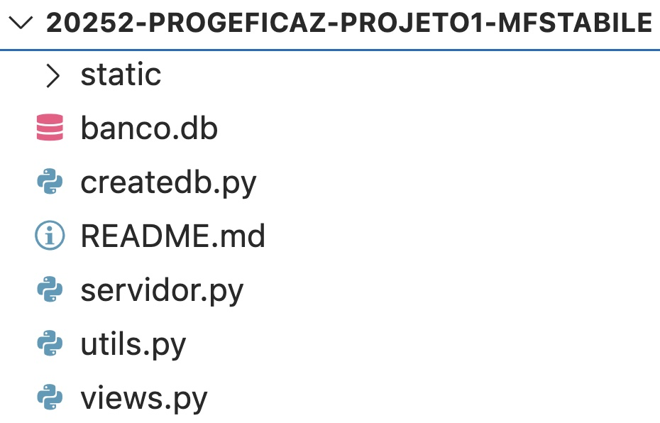
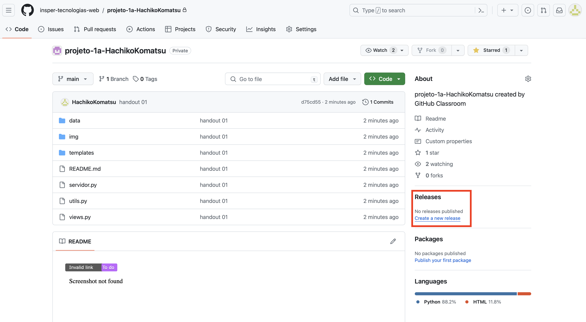
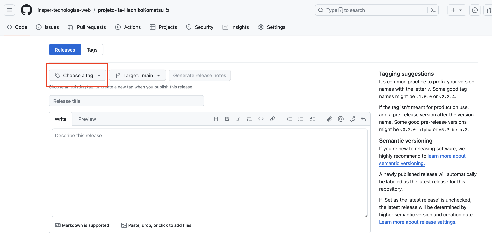
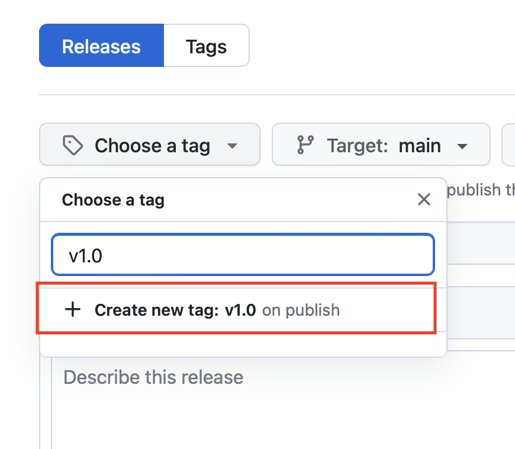
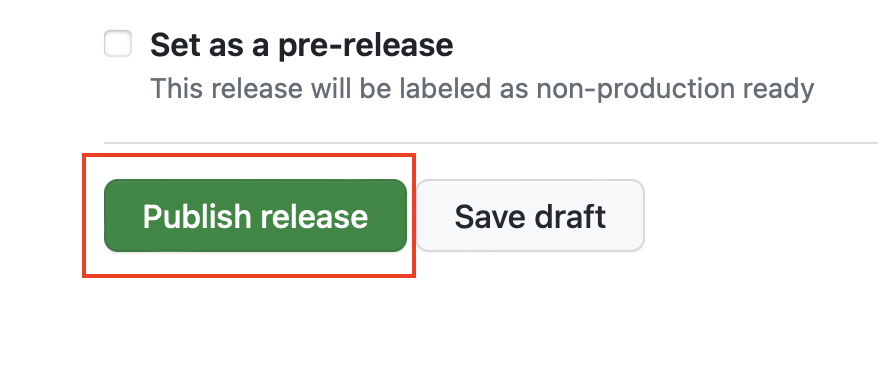
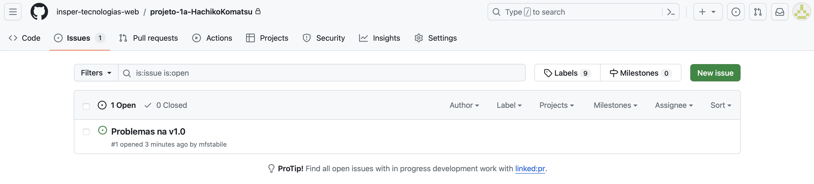
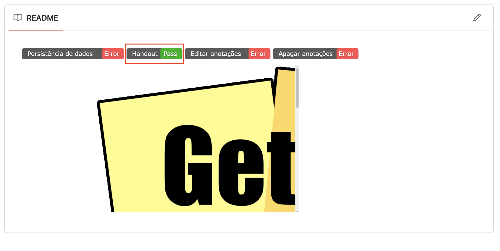
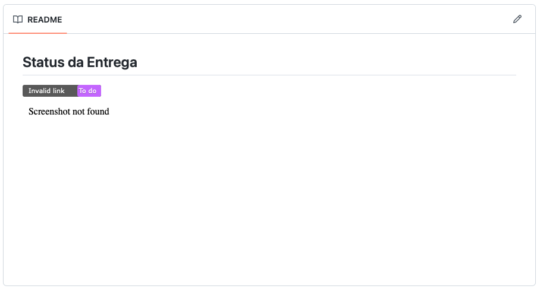

# Realizando uma submissão

Depois de configurar o WebHook do seu repositório Github vamos adicionar os arquivos referentes ao Handout 1.

Caso não tenha feito a configuração do WebHook, [clique aqui](guia-corr-aut.md) para configurar.

## Estrutura de diretórios

Copie os arquivos referentes ao Handout. O repositório do projeto deve seguir a seguinte estrutura de diretórios e nomenclatura de arquivos:

<figure markdown="span">
    { width="30%" }
    <figcaption>Organização do Repositório</figcaption>
</figure>

!!! danger "Importante"
    Como o projeto será corrigido automaticamente, é importante que você siga a estrutura de diretórios apresentada no handout.

    Além disso, o arquivo principal do projeto deve se chamar `servidor.py`.

### Arquivo .gitignore
Existem arquivos que não devem ser versionados no repositório. Um exemplo é a pasta `__pycache__` que é criado pelo Python. Se você procurar em seu repositório Github criado para o handout 1 verá que este pasta está lá.

Essa pasta é desnecessária para o repositório, pois é criada automaticamente pelo Python. Para evitar que ela seja versionada, deve existir um arquivo chamado `.gitignore` na raiz do seu repositório. Verifique se o arquivo `.gitignore` existe. Caso não exista, crie um arquivo chamado `.gitignore` na raiz do seu repositório e adicione o seguinte conteúdo:

```plaintext
__pycache__/
env/
```

## Criando um release

Para que o corretor automático possa corrigir o seu projeto, é necessário criar um release no Github. Para isso, siga os passos a seguir:

1. Acesse o repositório do seu projeto no Github. Procure o menu `Releases` e clique em `Create a new release`.

    <figure markdown="span">
        { width="100%" }
        <figcaption>Releases</figcaption>
    </figure>

2. **Clique no botão `Choose a tag`**
    <figure markdown="span">
        { width="100%" }
        <figcaption>Releases</figcaption>
    </figure>

3. Crie uma tag para o seu release. A tag deve ser `v1.0`.

    Sempre que for criar um release, crie uma nova tag utilizando o padrão v1.0, v1.1, v1.2, etc. Caso a release seja referente a uma nova funcionalidade implementada, incremente o primeiro número da tag. Por exemplo, se a release atual é v1.0 e você implementou uma nova funcionalidade, a tag da nova release deve ser v2.0. Caso a release seja referente a uma correção de bug, incremente o segundo número da tag. Por exemplo, se a release atual é v1.0 e você corrigiu um bug, a tag da nova release deve ser v1.1.

    <figure markdown="span">
        { width="50%" }
        <figcaption>Releases</figcaption>
    </figure>

    Digite o nome da tag e clique `+ Create new tag: v1.0`.

4. Preencha o campo `Release title` com o mesmo nome da tag `v1.0`, adicione uma descrição e clique em `Publish release`.

    <figure markdown="span">
        { width="60%" }
        <figcaption>Releases</figcaption>
    </figure>

Pronto! Agora os testes vão rodar. (Pode levar alguns minutos para que os testes sejam executados).

Sempre que algum teste não passar com sucesso, uma `issue` será aberta no seu repositório indicando o que está errado. Como não implementamos todas as funcionalidades do projeto, uma issue será aberta indicando quais itens faltam implementar.

<figure markdown="span">
    { width="100%" }
    <figcaption>Issue</figcaption>
</figure>

Se tudo estiver correto, uma imagem aparecerá no README do seu repositório indicando que os testes para o handout 01 passaram.

<figure markdown="span">
    { width="100%" }
    <figcaption>Testes handout 01 ok</figcaption>
</figure>


!!! danger "Importante"
    Sempre que gerar uma issue no repositório, para atualizar a imagem no README é recomendado que faça um hard refresh no navegador.

    Hard Refresh/Hard Reload são atalhos para forçar o navegador a carregar a versão mais recente de uma página. 
    
    - No Windows :material-microsoft-windows: e Linux :simple-linux:, pressione `Ctrl + F5`. 
    - No MacOS :material-apple:, pressione `Cmd + Shift + R`. 
    - Caso esses atalhos não funcionem, você pode pesquisar o atalho específico para o seu navegador.

!!! danger "Importante"
    O servidor deverá utilizar a porta `5000`

<!-- ## Erro no handout01


<figure markdown="span">
    { width="100%" }
    <figcaption>Corretor não identifica handout 01</figcaption>
</figure>

No arquivo `servidor.py` a variável `SERVER_HOST` deve ser `#!python "0.0.0.0"`. Para testar sua aplicação em seu computador (ambiente local), basta acessar `http://localhost:8080` ou `http://127.0.0.1:8080`.

Caso queira, pode alterar o `print` marcado abaixo por `#!python print('Servidor escutando em (ctrl+click): http://localhost:8080')`

```python hl_lines="2 10"
CUR_DIR = Path(__file__).parent
SERVER_HOST = '0.0.0.0'
SERVER_PORT = 8080

server_socket = socket.socket(socket.AF_INET, socket.SOCK_STREAM)
server_socket.setsockopt(socket.SOL_SOCKET, socket.SO_REUSEADDR, 1)
server_socket.bind((SERVER_HOST, SERVER_PORT))
server_socket.listen()

print(f'Servidor escutando em (ctrl+click): http://{SERVER_HOST}:{SERVER_PORT}')
``` -->
    
Agora podemos começar a tabalhar nas tarefas do Projeto 1.

[Tarefas do Projeto 1](tarefas-projeto1.md){ .md-button }
