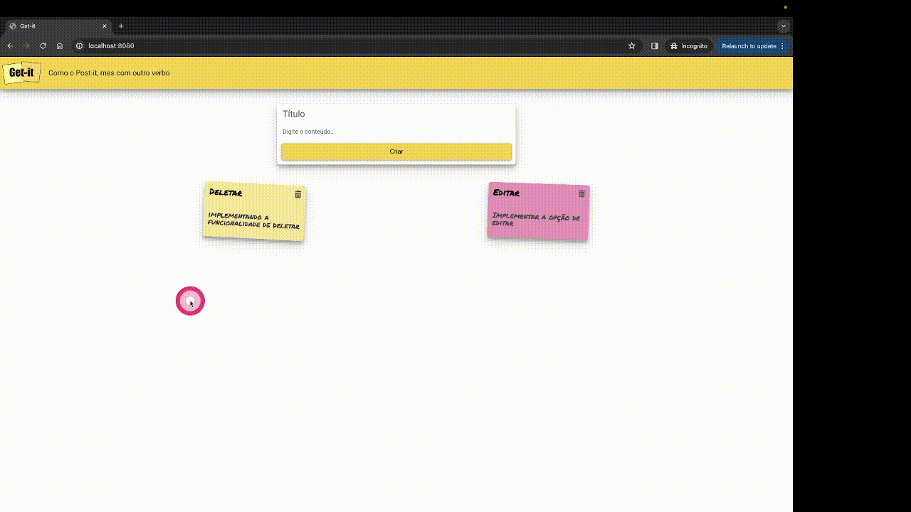
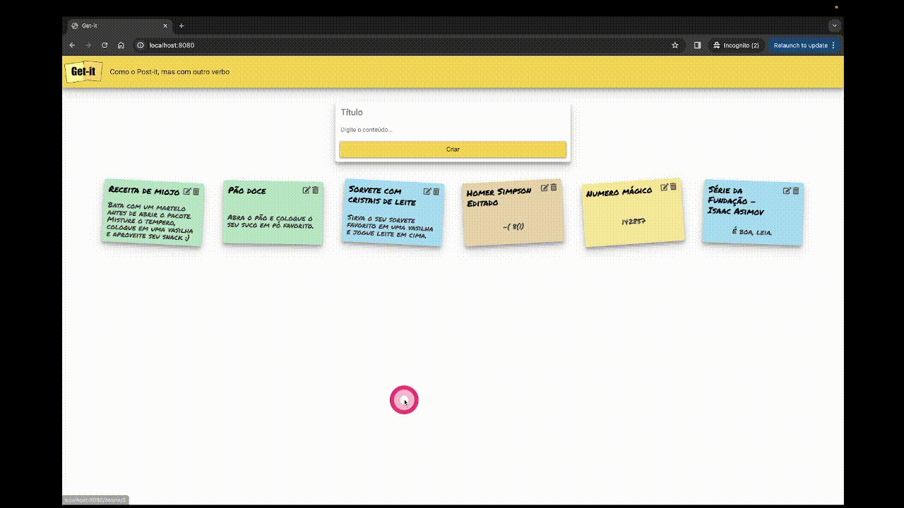

# Tarefas do Projeto 1A

No handout 01 vários trechos de código pronto foram apresentados e explicações foram dadas sobre como cada trecho funciona. Neste projeto será necessário que você implemente funcionalidades novas ao código base para verificar que compreendeu o funcionamento do código.

Para este projeto, vocêsdeve implementar as 4 funcionalidades a seguir:


## **1. Estilo da página** :dress:

- O estilo css já foi implementado semestre passado. Se você não guardou o arquivo, será um bom momento para relembrar os coonceitos de CSS.

Para isso, será necessário:

- Adicionar os arquivos `getit.css` e `getit.js` (se houver) na pasta do repositório do projeto mantendo a estrutura de pastas coerente.

- Alterar os arquivos `index.html` e `notes.html` para adicionar essas novas informações. Esta etapa deve ser realizada com cuidado pois simplesmente copiar o HTML do semestre passado não vai funcionar.

Realize alguns testes para inserir novas notas para verificar se as funcionalidades do Handout 01 continuam funcionando.

Ao finalizar esta etapa, a página deve estar com o estilo CSS e com as funcionalidades do Handout 01.

## **2. Persistência de dados** :material-dice-6:

Nesta etapa, você deverá implementar a persistência dos dados com SQLite utilizando os comandos aprendidos na APS 1.

**Dica** :material-alarm-light:

- Nesta etapa, as alterações podem ser feitas no arquivo `utils.py`. Procure todos os trechos de código que realizam leitura e escrita do arquivo `notes.json` e altere para que estas operações sejam realizadas no banco de dados.
    - **Dica** Faça as alterações aos poucos e teste! Evite fazer muitas alterações de uma vez só. Por exemplo, altere a função que lê o arquivo `notes.json` para que ela leia do banco de dados e verifique se a aplicação continua funcionando. Muito provavelmente, você perceberá que esqueceu de alterar alguma coisa e terá que consertar o código.

    Somente prossiga para a próxima alteração quando tiver certeza que a alteração anterior está funcionando corretamente.

- Ao finalizar esta etapa, caso não utilize mais o arquivo `notes.json`, apague o arquivo do repositório.

- Importante: O nome do banco de dados deve ser `banco.db` e ele deve estar na raiz do repositório. 
- O nome da tabela deve ser `notes` e ela deve conter pelo menos as colunas `id`, `title` e `content`. A coluna `id` deve ser uma chave primária e autoincrementada. Perceba que o nome da tabela e das colunas está em inglês, pois é uma convenção comum em bancos de dados relacionais. No entanto, o nome dos componentes da interface do usuário devem permanecer em português, como no handout.

- Material de apoio: [https://docs.python.org/3/library/sqlite3.html](https://docs.python.org/3/library/sqlite3.html)


## **3. Apagar anotações** :material-delete:

Permitir que o usuário apague uma anotação;

- Adicione um botão/link no `card` de cada nota existente para excluir esta nota.
- Um botão/link gera uma requisição quando o usuário clica nele. Quando adicinar um botão/link, faça um teste para ver a requisicão que é gerada.
- **Dica:** Trabalhar com link (elemento html <a\>) pode ser mais fácil do que trabalhar com botões (elemento html <\button>). Pesquise sobre a tag `#!html <a>`.
- Você pode utilizar o método **GET** ou **POST** para esta tarefa.
    - **GET:** Caso opte pelo método **GET** a requisição deve seguir o seguinte formato:
        ```
        GET /delete/<NOTA_ID> HTTP/1.1
        ```
        (Obs.: A rota pode variar um pouco dependendo da forma como você escolher implementar)
    - **POST:** Caso opte pelo método **POST** a requisição deve seguir o seguinte formato:
        ```
        POST /delete HTTP/1.1
        <HTTP_HEADERS>

        id=<NOTA_ID>
        ```
        Para enviar o id no formulário, pesquise por `#!html <input type="hidden" />`
- Importante: O link ou botão deve possuir o atributo `name='delete_button'` para que o teste de apagar anotações passe com sucesso.
- **Observação:** Note que o `id` da nota não deve aparecer na tela, pois esta informação é irrelevante para o usuário.

### Exemplo
<figure markdown="span">
    { width="100%" }
    <figcaption>Exemplo da funcionalidade de deletar</figcaption>
</figure>


## **4. Editar anotações** :material-file-edit:
Permitir a edição de anotações existentes;

- Adicione um botão/link na nota para a função de editar. Ao clicar no botão de edição, o usuário deve ser direcionado para uma página html nova de edição.
    - Ao clicar no botão/link, o servidor deverá receber uma requisição no seguinte formato:
        ```
        GET /update/<NOTA_ID> HTTP/1.1
        ```
- Importante: O link ou botão deve possuir o atributo `name='edit_button'` para que o teste de editar anotações passe com sucesso.
- A página de edição deve apresentar um formulário com o `título` e `conteúdo` já preenchidos.
- Você precisará de um método novo no arquivo `utils.py` que recebe como argumento o `id` de uma anotação e retorna esta anotação no formato de um objeto do tipo `Note`. 
- Esta página deve apresentar dois botões: `Salvar` e `Cancelar`. Caso os nomes sejam diferentes o teste de editar anotações não passará com sucesso.
    - Ao clicar no botão/link de `Cancelar` o usuário deve ser direcionado para a página principal.
    - Ao clicar no botão de `Salvar` a aplicação deve receber uma requisição no seguinte formato:
        ```
        POST /update HTTP/1.1
        <HTTP_HEADERS>

        id=<NOTA_ID>&titulo=<NOTA_TITULO>&detalhes=<NOTA_DETALHES>
        ```
    As alterações devem ser registradas no banco de dados e em seguida o usuário deve ser direcionado para a página inicial.

### Exemplo
<figure markdown="span">
    { width="100%" }
    <figcaption>Exemplo da funcionalidade de editar</figcaption>
</figure>


## Conceito A+

Para receber o conceito A+ você deve implementar a funcionalidade de favoritar anotações.

## **5. Marcar anotações como favoritas** :material-star:

Permitir que o usuário marque uma anotação como favorita;

- Adicione um botão/link no `card` de cada nota existente para favoritar/desfavoritar esta nota.
- Importante: O link ou botão deve possuir o atributo `name='favorite_button'` para que o teste de favoritar anotações passe com sucesso.
- Notas favoritadas devem ser exibidas antes das notas não favoritadas.
- Esta funcionalidade somente será considerada caso todos os testes anteriores estejam implementados e funcionando corretamente.
- Deve ser possível favoritar/desfavoritar uma anotação. Ou seja, se a anotação já estiver favoritada, ao clicar no botão/link de favoritar, a anotação deve ser desfavoritada e vice-versa.
- Deve haver uma indicação visual de que a anotação está favoritada. Por exemplo, você pode utilizar um ícone de estrela preenchida para indicar que a anotação está favoritada e um ícone de estrela vazia para indicar que a anotação não está favoritada.