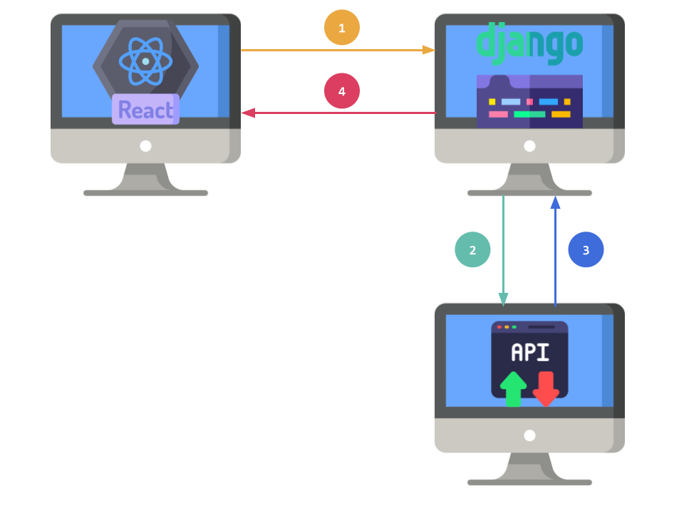

# Ajuda!

No projeto 2 vamos fazer uso de duas APIs, uma API de terceiros e uma API própria. Além disso, nosso projeto fará uso do projeto React. 

Aqui serão apresentados alguns exemplos para te ajudar a desenvolver o projeto.

## Escolha da API de terceiros

Para este exemplo, foi escolhida a API com dados de produtos [Real-Time Amazon Data](https://rapidapi.com/letscrape-6bRBa3QguO5/api/real-time-amazon-data){:target="_blank"}. 

A seguinte requisição traz os dados produto para a busca por "phone":

```javascript
const axios = require('axios');

const options = {
  method: 'GET',
  url: 'https://real-time-amazon-data.p.rapidapi.com/search',
  params: {
    query: 'Phone',
    page: '1',
    country: 'US',
    category_id: 'aps'
  },
  headers: {
    'X-RapidAPI-Key': 'YOUR_API_KEY',
    'X-RapidAPI-Host': 'real-time-amazon-data.p.rapidapi.com'
  }
};

try {
	const response = await axios.request(options);
	console.log(response.data);
} catch (error) {
	console.error(error);
}
```

Mas não queremos fazer esta requisição diretamente no código do React, pois este código contém a chave da API.

Para isso vamos realizar esta requisicão no Django.

<figure markdown="span">
    { width="80%" }
    <figcaption>Calendário com o cronograma</figcaption>
</figure>

Ou seja, na aplicação React teremos um formulário para o usuário digitar o produto que deseja buscar, ao preencher o formulário e clicar em buscar, o React fará uma requisição para o Django (passo 1 da figura). O Django REST fará a requisição para a API (passo 2 da figura). O Django REST receberá a resposta da API (passo 3 da figura) e enviará a resposta para o React (passo 4 da figura). O React receberá a resposta e exibirá os dados na tela.

## Fazendo a requisição no Django

Vamos criar uma rota no Django para fazer a requisição para a API de terceiros. Precisamos receber o nome do produto que o usuário deseja buscar. 
Podemos receber este nome na URL:

```python
from django.urls import path

from . import views

urlpatterns = [
    path('api/produtos/<str:produto>', views.api_produtos),
]
```

No arquivo `views.py` vamos implementar a função `api_produtos`:

```python
from rest_framework.decorators import api_view
import requests

@api_view(['GET'])
def api_produtos(request, produto):
    url = 'https://real-time-amazon-data.p.rapidapi.com/search'
    
    headers: {
        'X-RapidAPI-Key': 'YOUR_API_KEY',
        'X-RapidAPI-Host': 'real-time-amazon-data.p.rapidapi.com'
    }

    params = {
        'query': produto,
        'page': '1',
        'country': 'US',
        'category_id': 'aps'
    }
    response = requests.get(url, headers=headers, params=params)
    return Response(response.json())
```

Estamos utilizando a biblioteca `requests` para fazer a requisição para a API.

O código acima faz uma requisicão GET para a API (`https://real-time-amazon-data.p.rapidapi.com/search`). 
Para realizar a requisição é necessário passar a chave da API no cabeçalho da requisição. Além disso, é necessário passar os parâmetros da requisição, como a query, a página, o país e a categoria.

O retorno da API é um JSON (`#!python response.json()`). Pegamos este JSON e retornamos como resposta para a aplicação React.

Caso o json contenha muitos dados, podemos fazer um tratamento antes de retornar para o React.

Esta etapa concluímos os passos 2, 3 e 4 da figura.

!!! note "Teste"
    Faça um teste para verificar se a endpoint está funcionando corretamente.
    Abra o Postman e faça uma requisição para a endpoint que acabou de criar, se tudo der certo, você pode fazer a requisicão no React.

## Fazendo a requisição no React

Para realizar o passo 1 da figura, basta implementar uma função no React que faça a requisição para o Django.

Um exemplo de requisicão seria utilizando o `axios`:
```javascript
import axios from 'axios';

const buscarProdutos = async (produto) => {
    const response = await axios.get(`http://localhost:8000/api/produtos/${produto}`);
    console.log(response.data);
}
```


